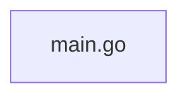

# gocallgraph

> Generated by greplost. Do not edit by hand; run `greplost update`.

Path: `bench/truth/gocallgraph` · 1 files · 444 LOC · depends on: none · depended on by: none

## Modules

```text
└── main.go
```

## Module table

| File | LOC | Exports | Fan-in | Fan-out | Blast |
|---|---|---|---|---|---|
| [`main.go`](modules/main.go.md) | 444 | 0 | 0 | 0 | 0 |

## Components



## External dependencies

- `encoding/json`
- `flag`
- `fmt`
- `go/ast`
- `go/token`
- `go/types`
- `golang.org/x/tools/go/callgraph/cha`
- `golang.org/x/tools/go/packages`
- `golang.org/x/tools/go/ssa`
- `golang.org/x/tools/go/ssa/ssautil`
- `os`
- `path/filepath`
- `sort`
- `strconv`
- `strings`
