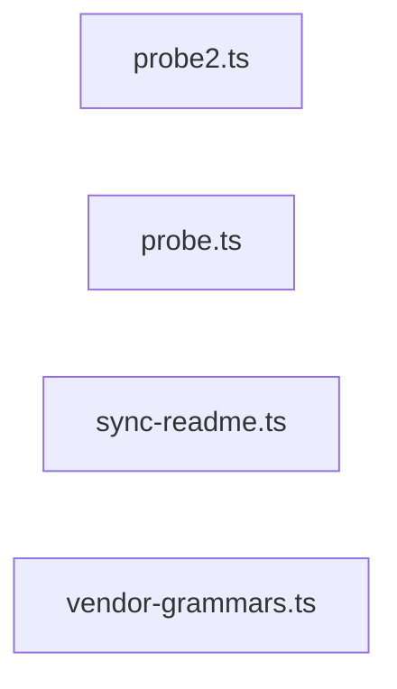

# greplost-monorepo

> Generated by greplost. Do not edit by hand; run `greplost update`.

Path: `.` · 4 files · 415 LOC · depends on: @greplost/core, @greplost/semantic, @greplost/sync · depended on by: none

## Modules

```text
├── .probe-leaf16
│   ├── probe.ts
│   └── probe2.ts
└── scripts
    ├── sync-readme.ts
    └── vendor-grammars.ts
```

## Module table

| File | LOC | Exports | Fan-in | Fan-out | Blast |
|---|---|---|---|---|---|
| [`.probe-leaf16/probe.ts`](modules/.probe-leaf16/probe.ts.md) | 214 | 0 | 0 | 5 | 0 |
| [`.probe-leaf16/probe2.ts`](modules/.probe-leaf16/probe2.ts.md) | 105 | 0 | 0 | 5 | 0 |
| [`scripts/sync-readme.ts`](modules/scripts/sync-readme.ts.md) | 79 | 5 | 0 | 0 | 0 |
| [`scripts/vendor-grammars.ts`](modules/scripts/vendor-grammars.ts.md) | 17 | 0 | 0 | 0 | 0 |

## Components



## External dependencies

- `node:crypto`
- `node:fs`
- `node:path`
