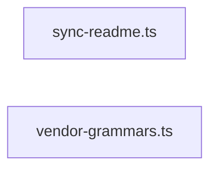

# greplost-monorepo

> Generated by greplost. Do not edit by hand; run `greplost update`.

Path: `.` · 2 files · 137 LOC · depends on: none · depended on by: none

## Modules

```text
└── scripts
    ├── sync-readme.ts
    └── vendor-grammars.ts
```

## Module table

| File | LOC | Exports | Fan-in | Fan-out | Blast |
|---|---|---|---|---|---|
| [`scripts/sync-readme.ts`](modules/scripts/sync-readme.ts.md) | 112 | 7 | 0 | 0 | 0 |
| [`scripts/vendor-grammars.ts`](modules/scripts/vendor-grammars.ts.md) | 25 | 0 | 0 | 0 | 0 |

## Components



## External dependencies

- `node:child_process`
- `node:fs`
- `node:path`
