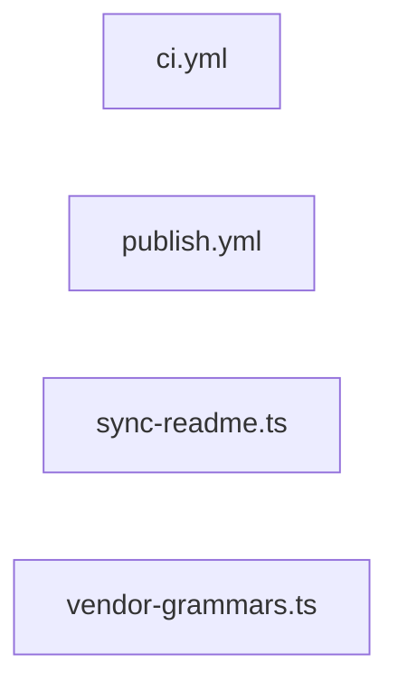

# greplost-monorepo

> Generated by greplost. Do not edit by hand; run `greplost update`.

Path: `.` · 4 files · 314 LOC · depends on: none · depended on by: none

## Modules

```text
├── .github
│   └── workflows
│       ├── ci.yml
│       └── publish.yml
└── scripts
    ├── sync-readme.ts
    └── vendor-grammars.ts
```

## Module table

| File | LOC | Exports | Fan-in | Fan-out | Blast |
|---|---|---|---|---|---|
| [`.github/workflows/ci.yml`](modules/.github/workflows/ci.yml.md) | 98 | 1 | 0 | 0 | 0 |
| [`.github/workflows/publish.yml`](modules/.github/workflows/publish.yml.md) | 79 | 2 | 0 | 0 | 0 |
| [`scripts/sync-readme.ts`](modules/scripts/sync-readme.ts.md) | 112 | 7 | 0 | 0 | 0 |
| [`scripts/vendor-grammars.ts`](modules/scripts/vendor-grammars.ts.md) | 25 | 0 | 0 | 0 | 0 |

## Nodes

| File | Nodes |
|---|---|
| [`.github/workflows/ci.yml`](modules/.github/workflows/ci.yml.md) | 25 |
| [`.github/workflows/publish.yml`](modules/.github/workflows/publish.yml.md) | 12 |

## Components



## External dependencies

- `node:child_process`
- `node:fs`
- `node:path`
