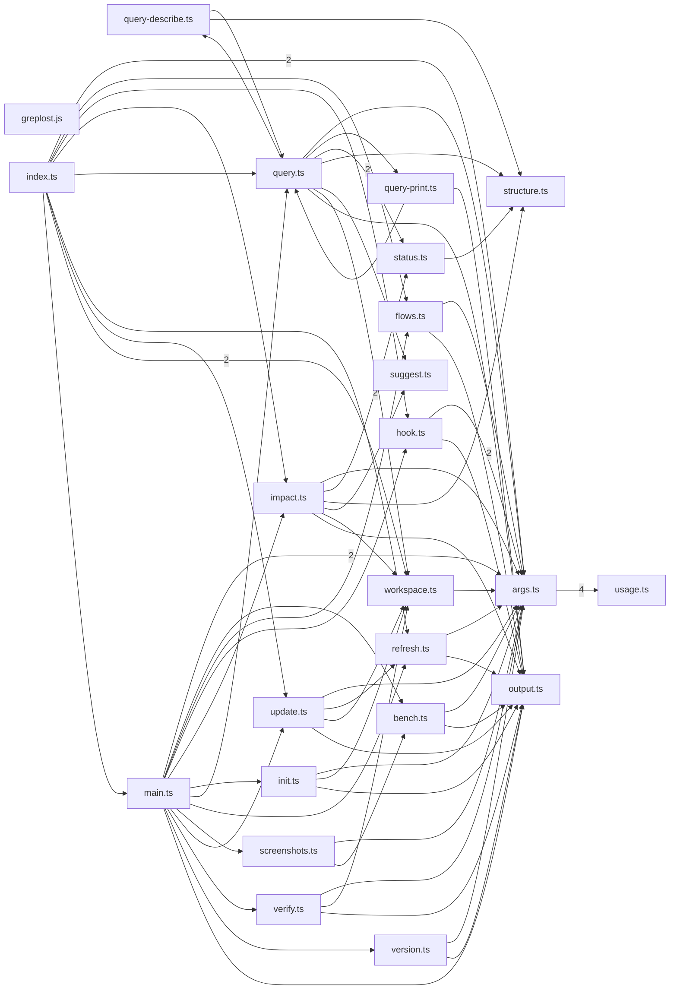

# greplost

> Generated by greplost. Do not edit by hand; run `greplost update`.

Path: `packages/cli` · 23 files · 3077 LOC · depends on: @greplost/core, @greplost/render, @greplost/semantic, @greplost/sync, @greplost/workspace · depended on by: none

## Modules

```text
├── bin
│   └── greplost.js
└── src
    ├── commands
    │   ├── bench.ts
    │   ├── flows.ts
    │   ├── hook.ts
    │   ├── impact.ts
    │   ├── init.ts
    │   ├── query-describe.ts
    │   ├── query-print.ts
    │   ├── query.ts
    │   ├── refresh.ts
    │   ├── screenshots.ts
    │   ├── status.ts
    │   ├── structure.ts
    │   ├── suggest.ts
    │   ├── update.ts
    │   ├── verify.ts
    │   ├── version.ts
    │   └── workspace.ts
    ├── args.ts
    ├── index.ts
    ├── main.ts
    ├── output.ts
    └── usage.ts
```

## Module table

| File | LOC | Exports | Fan-in | Fan-out | Blast |
|---|---|---|---|---|---|
| [`bin/greplost.js`](modules/bin/greplost.js.md) | 6 | 0 | 0 | 0 | 0 |
| [`src/args.ts`](modules/src/args.ts.md) | 450 | 12 | 14 | 2 | 16 |
| [`src/commands/bench.ts`](modules/src/commands/bench.ts.md) | 74 | 3 | 2 | 2 | 3 |
| [`src/commands/flows.ts`](modules/src/commands/flows.ts.md) | 43 | 2 | 2 | 4 | 2 |
| [`src/commands/hook.ts`](modules/src/commands/hook.ts.md) | 171 | 3 | 2 | 4 | 2 |
| [`src/commands/impact.ts`](modules/src/commands/impact.ts.md) | 157 | 5 | 2 | 7 | 2 |
| [`src/commands/init.ts`](modules/src/commands/init.ts.md) | 73 | 1 | 1 | 4 | 2 |
| [`src/commands/query-describe.ts`](modules/src/commands/query-describe.ts.md) | 222 | 7 | 1 | 5 | 4 |
| [`src/commands/query-print.ts`](modules/src/commands/query-print.ts.md) | 133 | 5 | 1 | 3 | 4 |
| [`src/commands/query.ts`](modules/src/commands/query.ts.md) | 324 | 10 | 4 | 10 | 4 |
| [`src/commands/refresh.ts`](modules/src/commands/refresh.ts.md) | 95 | 10 | 3 | 3 | 3 |
| [`src/commands/screenshots.ts`](modules/src/commands/screenshots.ts.md) | 13 | 1 | 1 | 2 | 2 |
| [`src/commands/status.ts`](modules/src/commands/status.ts.md) | 313 | 5 | 2 | 3 | 6 |
| [`src/commands/structure.ts`](modules/src/commands/structure.ts.md) | 183 | 10 | 4 | 4 | 7 |
| [`src/commands/suggest.ts`](modules/src/commands/suggest.ts.md) | 139 | 3 | 2 | 2 | 6 |
| [`src/commands/update.ts`](modules/src/commands/update.ts.md) | 80 | 2 | 2 | 5 | 2 |
| [`src/commands/verify.ts`](modules/src/commands/verify.ts.md) | 52 | 1 | 1 | 4 | 2 |
| [`src/commands/version.ts`](modules/src/commands/version.ts.md) | 16 | 1 | 1 | 2 | 2 |
| [`src/commands/workspace.ts`](modules/src/commands/workspace.ts.md) | 104 | 11 | 6 | 2 | 9 |
| [`src/index.ts`](modules/src/index.ts.md) | 31 | 26 | 0 | 9 | 0 |
| [`src/main.ts`](modules/src/main.ts.md) | 150 | 1 | 1 | 13 | 1 |
| [`src/output.ts`](modules/src/output.ts.md) | 88 | 10 | 12 | 2 | 15 |
| [`src/usage.ts`](modules/src/usage.ts.md) | 160 | 5 | 1 | 1 | 17 |

## Components



## External dependencies

- `node:child_process`
- `node:fs`
- `node:path`
- `node:url`
- `picomatch`
