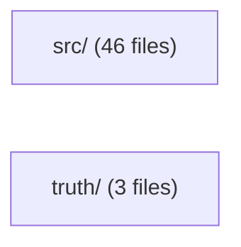
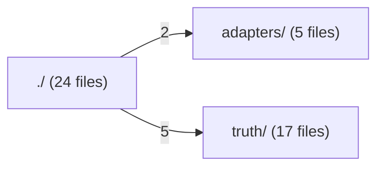
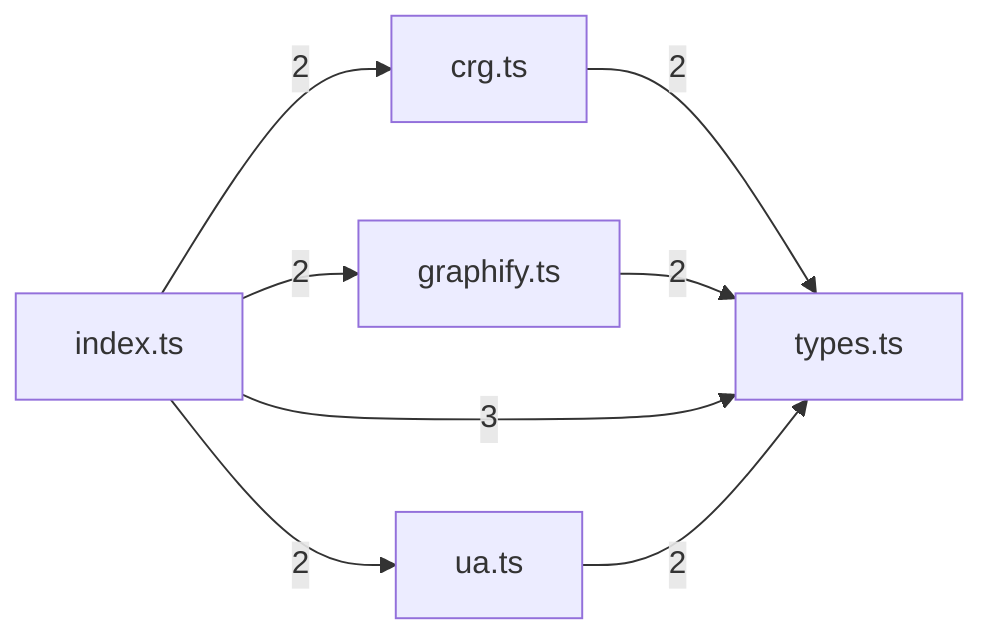
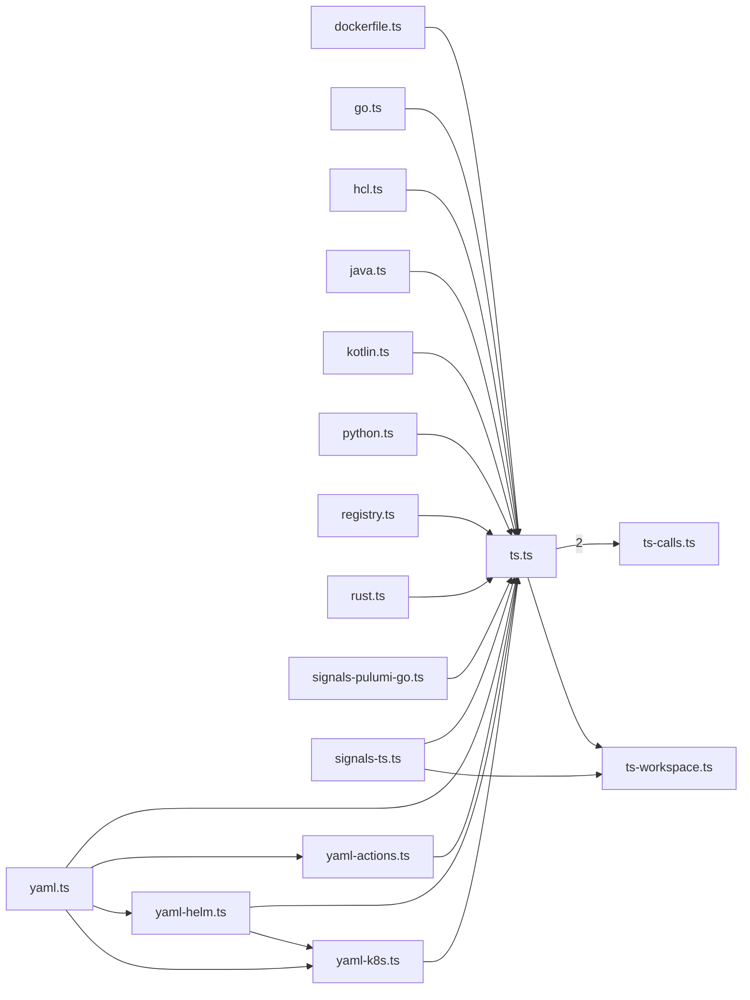
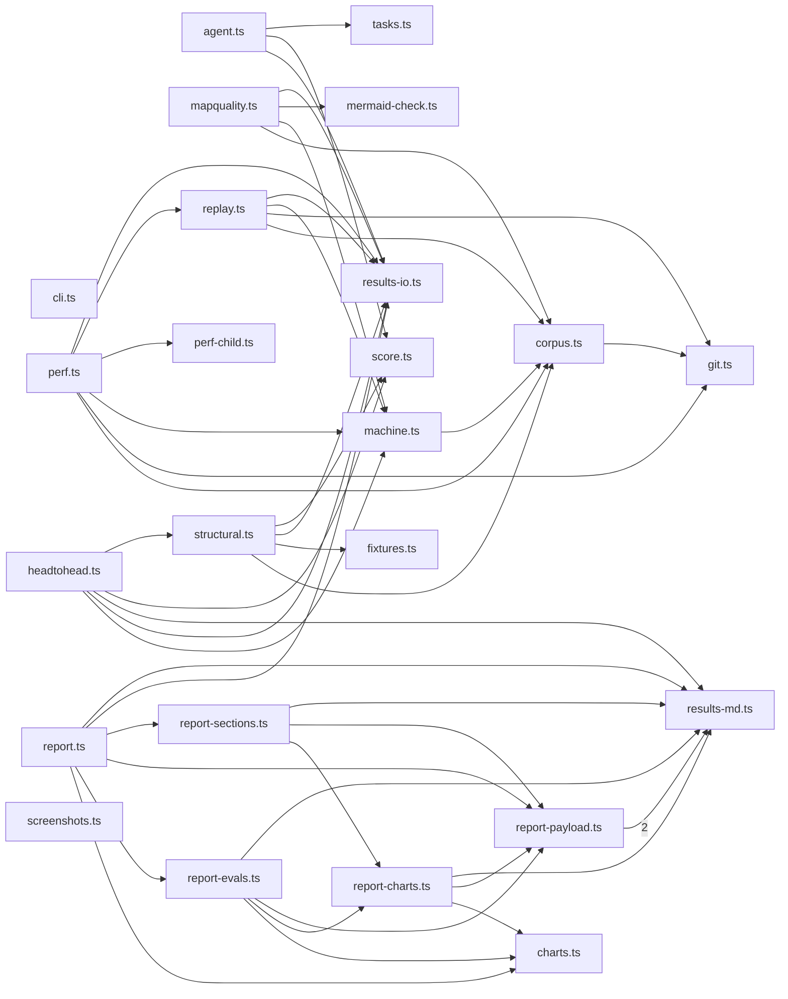
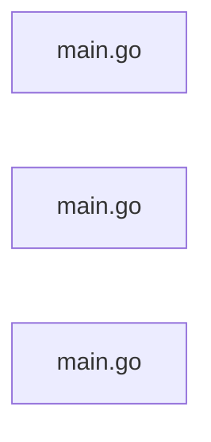

# @greplost/bench

> Generated by greplost. Do not edit by hand; run `greplost update`.

Path: `bench` · 49 files · 24915 LOC · depends on: @greplost/core, @greplost/sync · depended on by: none

## Modules

```text
├── src
│   ├── adapters
│   │   ├── crg.ts
│   │   ├── graphify.ts
│   │   ├── index.ts
│   │   ├── types.ts
│   │   └── ua.ts
│   ├── truth
│   │   ├── dockerfile.ts
│   │   ├── go.ts
│   │   ├── hcl.ts
│   │   ├── java.ts
│   │   ├── kotlin.ts
│   │   ├── python.ts
│   │   ├── registry.ts
│   │   ├── rust.ts
│   │   ├── signals-pulumi-go.ts
│   │   ├── signals-ts.ts
│   │   ├── ts-calls.ts
│   │   ├── ts-workspace.ts
│   │   ├── ts.ts
│   │   ├── yaml-actions.ts
│   │   ├── yaml-helm.ts
│   │   ├── yaml-k8s.ts
│   │   └── yaml.ts
│   ├── agent.ts
│   ├── charts.ts
│   ├── cli.ts
│   ├── corpus.ts
│   ├── fixtures.ts
│   ├── git.ts
│   ├── headtohead.ts
│   ├── machine.ts
│   ├── mapquality.ts
│   ├── mermaid-check.ts
│   ├── perf-child.ts
│   ├── perf.ts
│   ├── replay.ts
│   ├── report-charts.ts
│   ├── report-evals.ts
│   ├── report-payload.ts
│   ├── report-sections.ts
│   ├── report.ts
│   ├── results-io.ts
│   ├── results-md.ts
│   ├── score.ts
│   ├── screenshots.ts
│   ├── structural.ts
│   └── tasks.ts
└── truth
    ├── gocallgraph
    │   └── main.go
    ├── pulumigotruth
    │   └── main.go
    └── tfinspect
        └── main.go
```

## Module table

| File | LOC | Exports | Fan-in | Fan-out | Blast |
|---|---|---|---|---|---|
| [`src/adapters/crg.ts`](modules/src/adapters/crg.ts.md) | 233 | 1 | 1 | 2 | 2 |
| [`src/adapters/graphify.ts`](modules/src/adapters/graphify.ts.md) | 319 | 1 | 1 | 2 | 2 |
| [`src/adapters/index.ts`](modules/src/adapters/index.ts.md) | 97 | 12 | 1 | 4 | 1 |
| [`src/adapters/types.ts`](modules/src/adapters/types.ts.md) | 276 | 12 | 5 | 1 | 5 |
| [`src/adapters/ua.ts`](modules/src/adapters/ua.ts.md) | 263 | 1 | 1 | 2 | 2 |
| [`src/agent.ts`](modules/src/agent.ts.md) | 1752 | 17 | 0 | 5 | 0 |
| [`src/charts.ts`](modules/src/charts.ts.md) | 1485 | 34 | 3 | 0 | 4 |
| [`src/cli.ts`](modules/src/cli.ts.md) | 50 | 1 | 0 | 0 | 0 |
| [`src/corpus.ts`](modules/src/corpus.ts.md) | 286 | 12 | 5 | 2 | 6 |
| [`src/fixtures.ts`](modules/src/fixtures.ts.md) | 49 | 3 | 1 | 1 | 2 |
| [`src/git.ts`](modules/src/git.ts.md) | 202 | 12 | 3 | 0 | 7 |
| [`src/headtohead.ts`](modules/src/headtohead.ts.md) | 3350 | 43 | 0 | 9 | 0 |
| [`src/machine.ts`](modules/src/machine.ts.md) | 63 | 2 | 4 | 1 | 4 |
| [`src/mapquality.ts`](modules/src/mapquality.ts.md) | 424 | 10 | 0 | 5 | 0 |
| [`src/mermaid-check.ts`](modules/src/mermaid-check.ts.md) | 156 | 5 | 1 | 0 | 1 |
| [`src/perf-child.ts`](modules/src/perf-child.ts.md) | 107 | 5 | 1 | 1 | 1 |
| [`src/perf.ts`](modules/src/perf.ts.md) | 866 | 15 | 0 | 8 | 0 |
| [`src/replay.ts`](modules/src/replay.ts.md) | 915 | 14 | 1 | 6 | 1 |
| [`src/report-charts.ts`](modules/src/report-charts.ts.md) | 673 | 10 | 2 | 3 | 3 |
| [`src/report-evals.ts`](modules/src/report-evals.ts.md) | 567 | 6 | 1 | 4 | 1 |
| [`src/report-payload.ts`](modules/src/report-payload.ts.md) | 483 | 25 | 4 | 2 | 4 |
| [`src/report-sections.ts`](modules/src/report-sections.ts.md) | 439 | 3 | 1 | 3 | 1 |
| [`src/report.ts`](modules/src/report.ts.md) | 242 | 3 | 0 | 6 | 0 |
| [`src/results-io.ts`](modules/src/results-io.ts.md) | 141 | 8 | 7 | 1 | 7 |
| [`src/results-md.ts`](modules/src/results-md.ts.md) | 616 | 21 | 6 | 0 | 6 |
| [`src/score.ts`](modules/src/score.ts.md) | 100 | 6 | 3 | 1 | 3 |
| [`src/screenshots.ts`](modules/src/screenshots.ts.md) | 709 | 10 | 0 | 1 | 0 |
| [`src/structural.ts`](modules/src/structural.ts.md) | 1214 | 15 | 1 | 7 | 1 |
| [`src/tasks.ts`](modules/src/tasks.ts.md) | 536 | 16 | 1 | 2 | 1 |
| [`src/truth/dockerfile.ts`](modules/src/truth/dockerfile.ts.md) | 439 | 6 | 0 | 2 | 0 |
| [`src/truth/go.ts`](modules/src/truth/go.ts.md) | 306 | 3 | 0 | 2 | 0 |
| [`src/truth/hcl.ts`](modules/src/truth/hcl.ts.md) | 317 | 4 | 0 | 2 | 0 |
| [`src/truth/java.ts`](modules/src/truth/java.ts.md) | 361 | 3 | 0 | 2 | 0 |
| [`src/truth/kotlin.ts`](modules/src/truth/kotlin.ts.md) | 347 | 6 | 0 | 2 | 0 |
| [`src/truth/python.ts`](modules/src/truth/python.ts.md) | 234 | 5 | 0 | 2 | 0 |
| [`src/truth/registry.ts`](modules/src/truth/registry.ts.md) | 87 | 4 | 1 | 2 | 2 |
| [`src/truth/rust.ts`](modules/src/truth/rust.ts.md) | 268 | 3 | 0 | 2 | 0 |
| [`src/truth/signals-pulumi-go.ts`](modules/src/truth/signals-pulumi-go.ts.md) | 248 | 5 | 0 | 2 | 0 |
| [`src/truth/signals-ts.ts`](modules/src/truth/signals-ts.ts.md) | 991 | 5 | 0 | 3 | 0 |
| [`src/truth/ts-calls.ts`](modules/src/truth/ts-calls.ts.md) | 214 | 9 | 1 | 1 | 19 |
| [`src/truth/ts-workspace.ts`](modules/src/truth/ts-workspace.ts.md) | 355 | 1 | 2 | 0 | 19 |
| [`src/truth/ts.ts`](modules/src/truth/ts.ts.md) | 691 | 4 | 18 | 3 | 18 |
| [`src/truth/yaml-actions.ts`](modules/src/truth/yaml-actions.ts.md) | 471 | 5 | 1 | 2 | 1 |
| [`src/truth/yaml-helm.ts`](modules/src/truth/yaml-helm.ts.md) | 525 | 8 | 1 | 3 | 1 |
| [`src/truth/yaml-k8s.ts`](modules/src/truth/yaml-k8s.ts.md) | 440 | 4 | 2 | 2 | 2 |
| [`src/truth/yaml.ts`](modules/src/truth/yaml.ts.md) | 198 | 8 | 0 | 5 | 0 |
| [`truth/gocallgraph/main.go`](modules/truth/gocallgraph/main.go.md) | 444 | 0 | 0 | 0 | 0 |
| [`truth/pulumigotruth/main.go`](modules/truth/pulumigotruth/main.go.md) | 484 | 0 | 0 | 0 | 0 |
| [`truth/tfinspect/main.go`](modules/truth/tfinspect/main.go.md) | 882 | 0 | 0 | 0 | 0 |

## Components

### bench (overview)



### bench/src (overview)



### bench/src/adapters



### bench/src/truth



### bench/src



### bench/truth



## External dependencies

- `dockerfile-ast`
- `encoding/json`
- `fast-glob`
- `flag`
- `fmt`
- `github.com/hashicorp/hcl/v2`
- `github.com/hashicorp/hcl/v2/hclparse`
- `github.com/hashicorp/hcl/v2/hclsyntax`
- `github.com/hashicorp/terraform-config-inspect/tfconfig`
- `go/ast`
- `go/token`
- `go/types`
- `golang.org/x/tools/go/callgraph/cha`
- `golang.org/x/tools/go/packages`
- `golang.org/x/tools/go/ssa`
- `golang.org/x/tools/go/ssa/ssautil`
- `io/fs`
- `js-tiktoken`
- `js-yaml`
- `jsdom`
- `mermaid`
- `node:child_process`
- `node:crypto`
- `node:fs`
- `node:module`
- `node:os`
- `node:path`
- `node:perf_hooks`
- `node:url`
- `os`
- `path/filepath`
- `sort`
- `strconv`
- `strings`
- `typescript`
