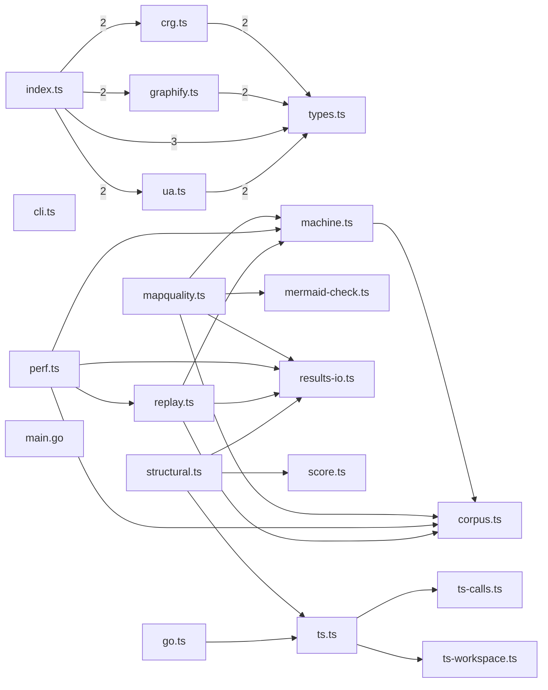

# @greplost/bench

> Generated by greplost. Do not edit by hand; run `greplost update`.

Path: `bench` · 20 files · 6593 LOC · depends on: @greplost/core, @greplost/sync · depended on by: none

## Modules

```text
├── src
│   ├── adapters
│   │   ├── crg.ts
│   │   ├── graphify.ts
│   │   ├── index.ts
│   │   ├── types.ts
│   │   └── ua.ts
│   ├── truth
│   │   ├── go.ts
│   │   ├── ts-calls.ts
│   │   ├── ts-workspace.ts
│   │   └── ts.ts
│   ├── cli.ts
│   ├── corpus.ts
│   ├── machine.ts
│   ├── mapquality.ts
│   ├── mermaid-check.ts
│   ├── perf.ts
│   ├── replay.ts
│   ├── results-io.ts
│   ├── score.ts
│   └── structural.ts
└── truth
    └── gocallgraph
        └── main.go
```

## Module table

| File | LOC | Exports | Fan-in | Fan-out | Blast |
|---|---|---|---|---|---|
| [`src/adapters/crg.ts`](modules/src/adapters/crg.ts.md) | 233 | 1 | 1 | 2 | 1 |
| [`src/adapters/graphify.ts`](modules/src/adapters/graphify.ts.md) | 319 | 1 | 1 | 2 | 1 |
| [`src/adapters/index.ts`](modules/src/adapters/index.ts.md) | 97 | 12 | 0 | 4 | 0 |
| [`src/adapters/types.ts`](modules/src/adapters/types.ts.md) | 276 | 12 | 4 | 1 | 4 |
| [`src/adapters/ua.ts`](modules/src/adapters/ua.ts.md) | 263 | 1 | 1 | 2 | 1 |
| [`src/cli.ts`](modules/src/cli.ts.md) | 50 | 1 | 0 | 0 | 0 |
| [`src/corpus.ts`](modules/src/corpus.ts.md) | 279 | 12 | 4 | 0 | 4 |
| [`src/machine.ts`](modules/src/machine.ts.md) | 63 | 2 | 3 | 1 | 3 |
| [`src/mapquality.ts`](modules/src/mapquality.ts.md) | 291 | 8 | 0 | 5 | 0 |
| [`src/mermaid-check.ts`](modules/src/mermaid-check.ts.md) | 156 | 5 | 1 | 0 | 1 |
| [`src/perf.ts`](modules/src/perf.ts.md) | 906 | 14 | 0 | 6 | 0 |
| [`src/replay.ts`](modules/src/replay.ts.md) | 1012 | 19 | 1 | 5 | 1 |
| [`src/results-io.ts`](modules/src/results-io.ts.md) | 96 | 6 | 4 | 1 | 4 |
| [`src/score.ts`](modules/src/score.ts.md) | 100 | 6 | 1 | 1 | 1 |
| [`src/structural.ts`](modules/src/structural.ts.md) | 622 | 8 | 0 | 4 | 0 |
| [`src/truth/go.ts`](modules/src/truth/go.ts.md) | 235 | 3 | 0 | 2 | 0 |
| [`src/truth/ts-calls.ts`](modules/src/truth/ts-calls.ts.md) | 204 | 7 | 1 | 1 | 3 |
| [`src/truth/ts-workspace.ts`](modules/src/truth/ts-workspace.ts.md) | 355 | 1 | 1 | 0 | 3 |
| [`src/truth/ts.ts`](modules/src/truth/ts.ts.md) | 600 | 4 | 2 | 3 | 2 |
| [`truth/gocallgraph/main.go`](modules/truth/gocallgraph/main.go.md) | 436 | 0 | 0 | 0 | 0 |

## Components



## External dependencies

- `encoding/json`
- `fast-glob`
- `flag`
- `fmt`
- `go/ast`
- `go/token`
- `go/types`
- `golang.org/x/tools/go/callgraph/cha`
- `golang.org/x/tools/go/packages`
- `golang.org/x/tools/go/ssa`
- `golang.org/x/tools/go/ssa/ssautil`
- `js-tiktoken`
- `jsdom`
- `mermaid`
- `node:child_process`
- `node:crypto`
- `node:fs`
- `node:os`
- `node:path`
- `node:perf_hooks`
- `node:url`
- `os`
- `path/filepath`
- `sort`
- `strconv`
- `strings`
- `typescript`
