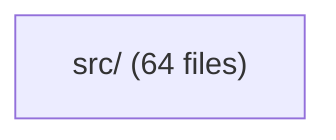
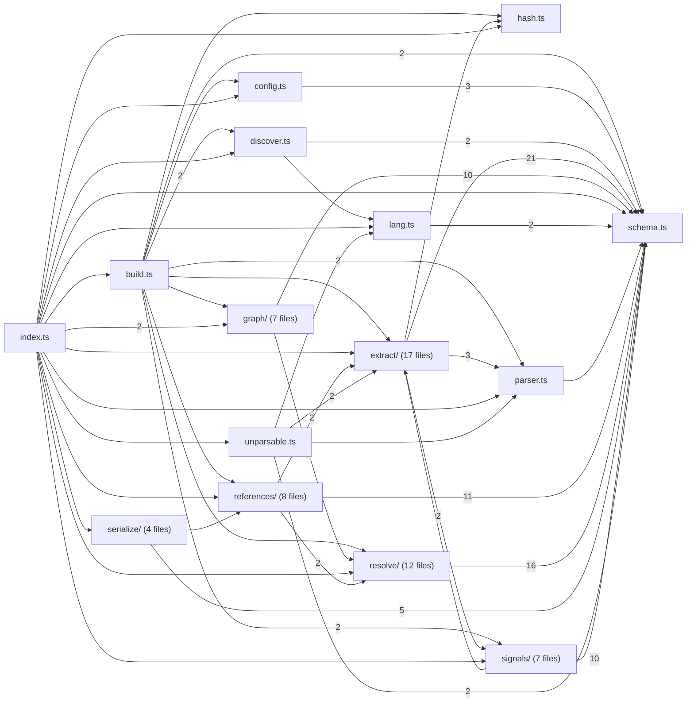
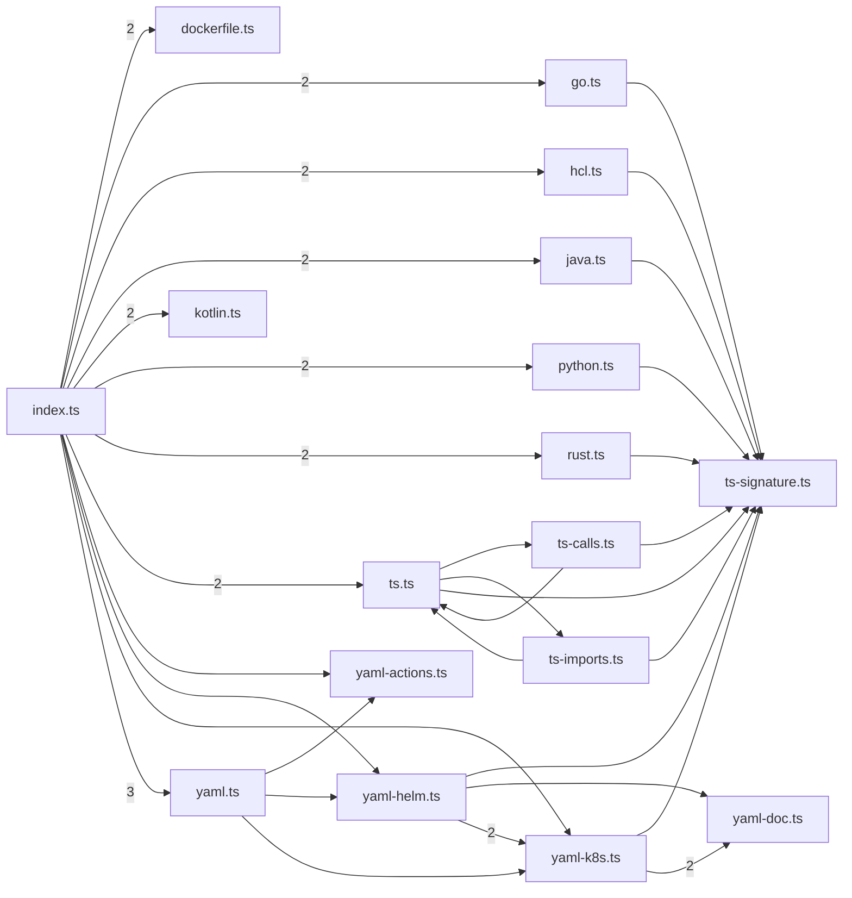
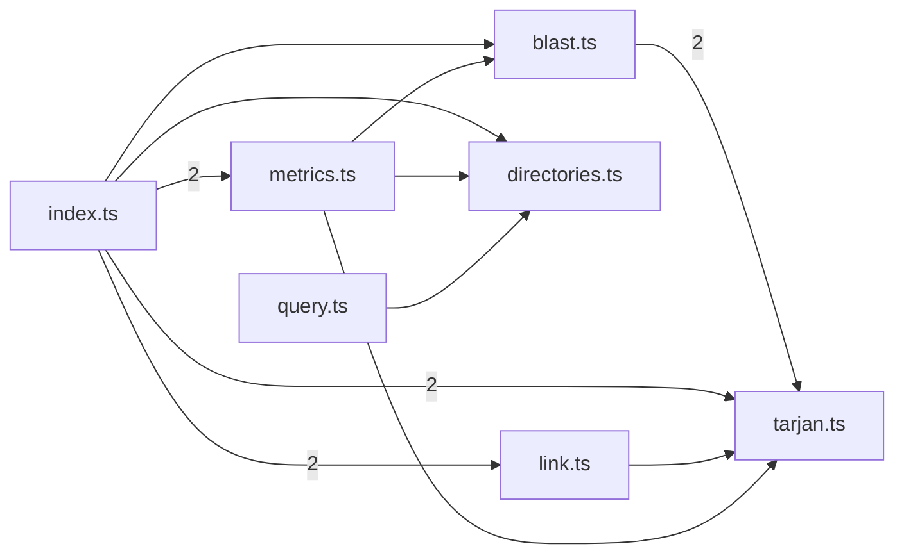
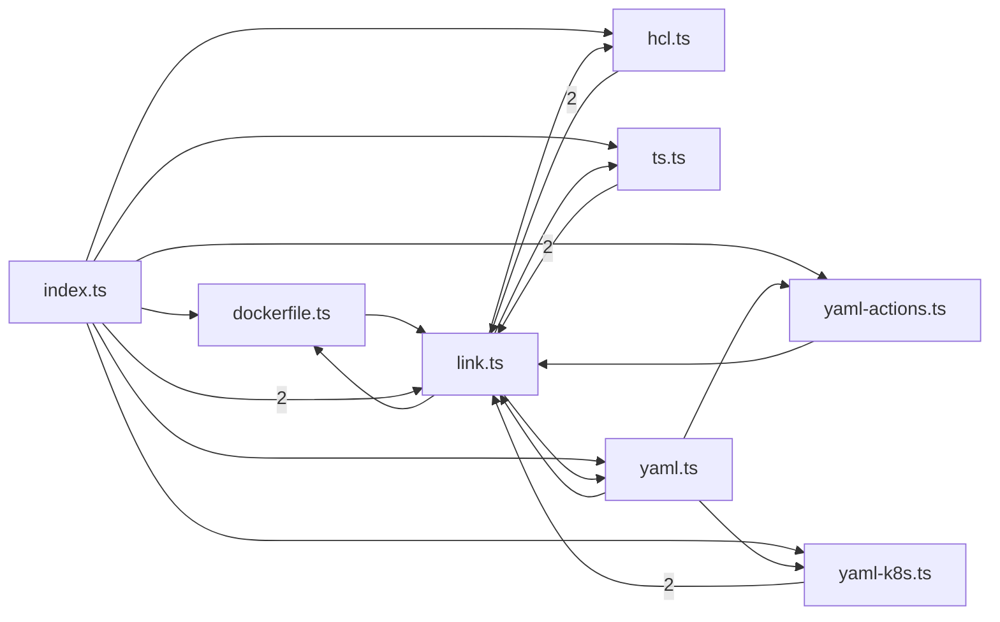
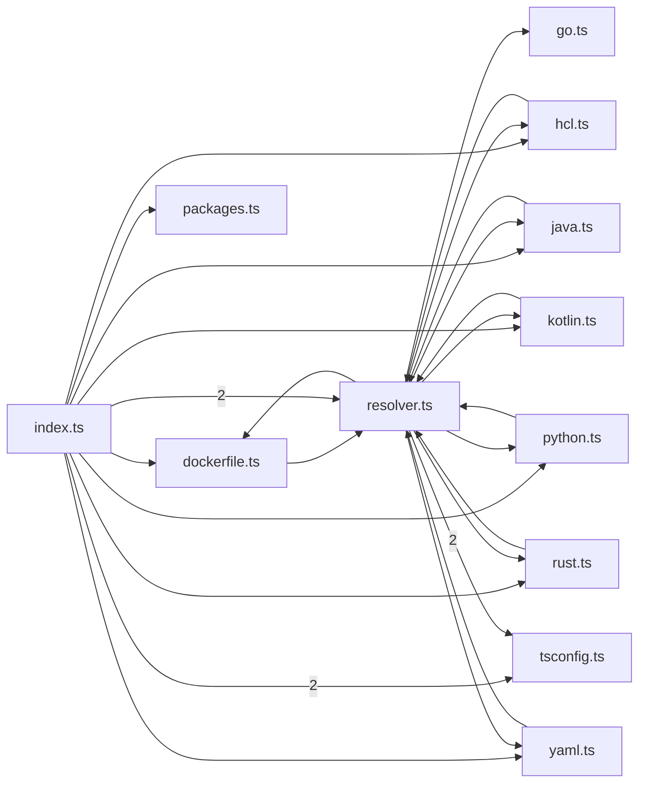
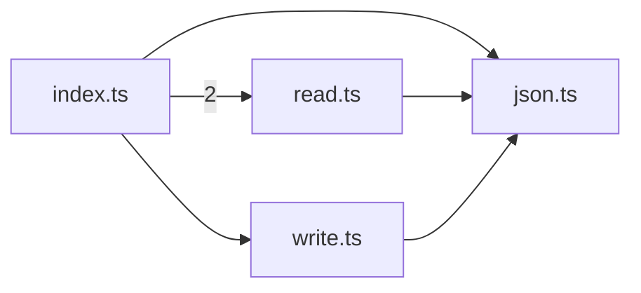
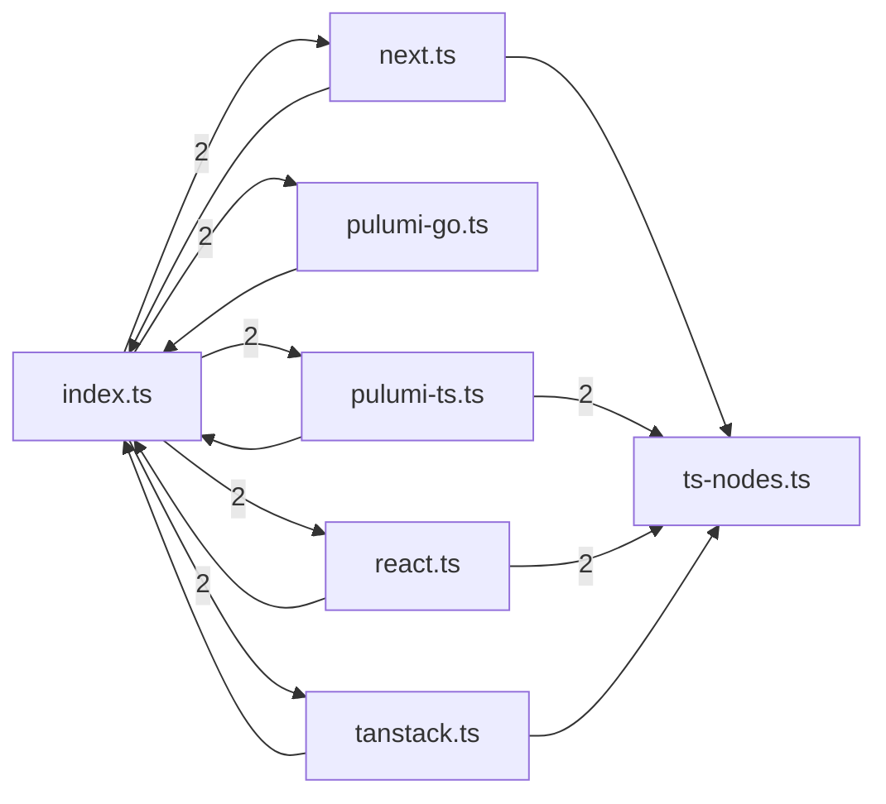

# @greplost/core

> Generated by greplost. Do not edit by hand; run `greplost update`.

Path: `packages/core` · 64 files · 14846 LOC · depends on: none · depended on by: @greplost/bench, @greplost/render, @greplost/semantic, @greplost/sync, @greplost/workspace, greplost

## Modules

```text
└── src
    ├── extract
    │   ├── dockerfile.ts
    │   ├── go.ts
    │   ├── hcl.ts
    │   ├── index.ts
    │   ├── java.ts
    │   ├── kotlin.ts
    │   ├── python.ts
    │   ├── rust.ts
    │   ├── ts-calls.ts
    │   ├── ts-imports.ts
    │   ├── ts-signature.ts
    │   ├── ts.ts
    │   ├── yaml-actions.ts
    │   ├── yaml-doc.ts
    │   ├── yaml-helm.ts
    │   ├── yaml-k8s.ts
    │   └── yaml.ts
    ├── graph
    │   ├── blast.ts
    │   ├── directories.ts
    │   ├── index.ts
    │   ├── link.ts
    │   ├── metrics.ts
    │   ├── query.ts
    │   └── tarjan.ts
    ├── references
    │   ├── dockerfile.ts
    │   ├── hcl.ts
    │   ├── index.ts
    │   ├── link.ts
    │   ├── ts.ts
    │   ├── yaml-actions.ts
    │   ├── yaml-k8s.ts
    │   └── yaml.ts
    ├── resolve
    │   ├── dockerfile.ts
    │   ├── go.ts
    │   ├── hcl.ts
    │   ├── index.ts
    │   ├── java.ts
    │   ├── kotlin.ts
    │   ├── packages.ts
    │   ├── python.ts
    │   ├── resolver.ts
    │   ├── rust.ts
    │   ├── tsconfig.ts
    │   └── yaml.ts
    ├── serialize
    │   ├── index.ts
    │   ├── json.ts
    │   ├── read.ts
    │   └── write.ts
    ├── signals
    │   ├── index.ts
    │   ├── next.ts
    │   ├── pulumi-go.ts
    │   ├── pulumi-ts.ts
    │   ├── react.ts
    │   ├── tanstack.ts
    │   └── ts-nodes.ts
    ├── build.ts
    ├── config.ts
    ├── discover.ts
    ├── hash.ts
    ├── index.ts
    ├── lang.ts
    ├── parser.ts
    ├── schema.ts
    └── unparsable.ts
```

## Module table

| File | LOC | Exports | Fan-in | Fan-out | Blast |
|---|---|---|---|---|---|
| [`src/build.ts`](modules/src/build.ts.md) | 407 | 3 | 1 | 10 | 29 |
| [`src/config.ts`](modules/src/config.ts.md) | 153 | 2 | 2 | 1 | 30 |
| [`src/discover.ts`](modules/src/discover.ts.md) | 141 | 3 | 2 | 2 | 30 |
| [`src/extract/dockerfile.ts`](modules/src/extract/dockerfile.ts.md) | 18 | 1 | 1 | 1 | 31 |
| [`src/extract/go.ts`](modules/src/extract/go.ts.md) | 412 | 2 | 1 | 2 | 31 |
| [`src/extract/hcl.ts`](modules/src/extract/hcl.ts.md) | 707 | 2 | 2 | 2 | 41 |
| [`src/extract/index.ts`](modules/src/extract/index.ts.md) | 153 | 17 | 2 | 16 | 30 |
| [`src/extract/java.ts`](modules/src/extract/java.ts.md) | 618 | 1 | 1 | 2 | 31 |
| [`src/extract/kotlin.ts`](modules/src/extract/kotlin.ts.md) | 18 | 1 | 1 | 1 | 31 |
| [`src/extract/python.ts`](modules/src/extract/python.ts.md) | 821 | 1 | 1 | 2 | 31 |
| [`src/extract/rust.ts`](modules/src/extract/rust.ts.md) | 699 | 1 | 1 | 2 | 31 |
| [`src/extract/ts-calls.ts`](modules/src/extract/ts-calls.ts.md) | 84 | 3 | 1 | 2 | 33 |
| [`src/extract/ts-imports.ts`](modules/src/extract/ts-imports.ts.md) | 335 | 4 | 1 | 3 | 33 |
| [`src/extract/ts-signature.ts`](modules/src/extract/ts-signature.ts.md) | 187 | 19 | 11 | 0 | 60 |
| [`src/extract/ts.ts`](modules/src/extract/ts.ts.md) | 860 | 2 | 3 | 5 | 33 |
| [`src/extract/yaml-actions.ts`](modules/src/extract/yaml-actions.ts.md) | 19 | 1 | 2 | 1 | 43 |
| [`src/extract/yaml-doc.ts`](modules/src/extract/yaml-doc.ts.md) | 257 | 14 | 2 | 0 | 45 |
| [`src/extract/yaml-helm.ts`](modules/src/extract/yaml-helm.ts.md) | 343 | 3 | 3 | 5 | 43 |
| [`src/extract/yaml-k8s.ts`](modules/src/extract/yaml-k8s.ts.md) | 467 | 6 | 3 | 3 | 44 |
| [`src/extract/yaml.ts`](modules/src/extract/yaml.ts.md) | 162 | 7 | 3 | 4 | 42 |
| [`src/graph/blast.ts`](modules/src/graph/blast.ts.md) | 112 | 2 | 2 | 2 | 47 |
| [`src/graph/directories.ts`](modules/src/graph/directories.ts.md) | 122 | 5 | 3 | 1 | 48 |
| [`src/graph/index.ts`](modules/src/graph/index.ts.md) | 14 | 18 | 10 | 5 | 45 |
| [`src/graph/link.ts`](modules/src/graph/link.ts.md) | 621 | 8 | 1 | 6 | 46 |
| [`src/graph/metrics.ts`](modules/src/graph/metrics.ts.md) | 150 | 3 | 1 | 5 | 46 |
| [`src/graph/query.ts`](modules/src/graph/query.ts.md) | 81 | 3 | 1 | 2 | 29 |
| [`src/graph/tarjan.ts`](modules/src/graph/tarjan.ts.md) | 152 | 4 | 4 | 1 | 49 |
| [`src/hash.ts`](modules/src/hash.ts.md) | 28 | 2 | 3 | 0 | 31 |
| [`src/index.ts`](modules/src/index.ts.md) | 31 | 156 | 10 | 15 | 28 |
| [`src/lang.ts`](modules/src/lang.ts.md) | 33 | 1 | 3 | 1 | 32 |
| [`src/parser.ts`](modules/src/parser.ts.md) | 162 | 5 | 6 | 1 | 47 |
| [`src/references/dockerfile.ts`](modules/src/references/dockerfile.ts.md) | 20 | 1 | 2 | 2 | 39 |
| [`src/references/hcl.ts`](modules/src/references/hcl.ts.md) | 221 | 1 | 2 | 4 | 39 |
| [`src/references/index.ts`](modules/src/references/index.ts.md) | 16 | 11 | 2 | 7 | 30 |
| [`src/references/link.ts`](modules/src/references/link.ts.md) | 174 | 5 | 8 | 6 | 39 |
| [`src/references/ts.ts`](modules/src/references/ts.ts.md) | 159 | 1 | 2 | 2 | 39 |
| [`src/references/yaml-actions.ts`](modules/src/references/yaml-actions.ts.md) | 21 | 1 | 2 | 2 | 39 |
| [`src/references/yaml-k8s.ts`](modules/src/references/yaml-k8s.ts.md) | 196 | 1 | 2 | 2 | 39 |
| [`src/references/yaml.ts`](modules/src/references/yaml.ts.md) | 32 | 1 | 2 | 5 | 39 |
| [`src/resolve/dockerfile.ts`](modules/src/resolve/dockerfile.ts.md) | 33 | 3 | 2 | 2 | 66 |
| [`src/resolve/go.ts`](modules/src/resolve/go.ts.md) | 331 | 8 | 2 | 1 | 67 |
| [`src/resolve/hcl.ts`](modules/src/resolve/hcl.ts.md) | 131 | 8 | 3 | 2 | 66 |
| [`src/resolve/index.ts`](modules/src/resolve/index.ts.md) | 21 | 22 | 3 | 10 | 47 |
| [`src/resolve/java.ts`](modules/src/resolve/java.ts.md) | 389 | 4 | 3 | 2 | 66 |
| [`src/resolve/kotlin.ts`](modules/src/resolve/kotlin.ts.md) | 29 | 3 | 2 | 2 | 66 |
| [`src/resolve/packages.ts`](modules/src/resolve/packages.ts.md) | 401 | 2 | 1 | 1 | 48 |
| [`src/resolve/python.ts`](modules/src/resolve/python.ts.md) | 588 | 7 | 3 | 2 | 66 |
| [`src/resolve/resolver.ts`](modules/src/resolve/resolver.ts.md) | 578 | 4 | 9 | 10 | 66 |
| [`src/resolve/rust.ts`](modules/src/resolve/rust.ts.md) | 657 | 4 | 3 | 2 | 66 |
| [`src/resolve/tsconfig.ts`](modules/src/resolve/tsconfig.ts.md) | 316 | 3 | 2 | 0 | 67 |
| [`src/resolve/yaml.ts`](modules/src/resolve/yaml.ts.md) | 29 | 2 | 2 | 2 | 66 |
| [`src/schema.ts`](modules/src/schema.ts.md) | 498 | 48 | 120 | 0 | 151 |
| [`src/serialize/index.ts`](modules/src/serialize/index.ts.md) | 4 | 6 | 1 | 3 | 29 |
| [`src/serialize/json.ts`](modules/src/serialize/json.ts.md) | 35 | 3 | 3 | 1 | 32 |
| [`src/serialize/read.ts`](modules/src/serialize/read.ts.md) | 72 | 2 | 1 | 2 | 30 |
| [`src/serialize/write.ts`](modules/src/serialize/write.ts.md) | 32 | 1 | 1 | 3 | 30 |
| [`src/signals/index.ts`](modules/src/signals/index.ts.md) | 138 | 12 | 8 | 6 | 36 |
| [`src/signals/next.ts`](modules/src/signals/next.ts.md) | 210 | 2 | 1 | 3 | 36 |
| [`src/signals/pulumi-go.ts`](modules/src/signals/pulumi-go.ts.md) | 22 | 1 | 1 | 2 | 36 |
| [`src/signals/pulumi-ts.ts`](modules/src/signals/pulumi-ts.ts.md) | 290 | 1 | 1 | 3 | 36 |
| [`src/signals/react.ts`](modules/src/signals/react.ts.md) | 248 | 1 | 1 | 3 | 36 |
| [`src/signals/tanstack.ts`](modules/src/signals/tanstack.ts.md) | 215 | 1 | 1 | 3 | 36 |
| [`src/signals/ts-nodes.ts`](modules/src/signals/ts-nodes.ts.md) | 259 | 16 | 4 | 2 | 37 |
| [`src/unparsable.ts`](modules/src/unparsable.ts.md) | 114 | 3 | 1 | 5 | 29 |

## Components

### packages/core (overview)



### packages/core/src (overview)



### packages/core/src/extract



### packages/core/src/graph



### packages/core/src/references



### packages/core/src/resolve



### packages/core/src/serialize



### packages/core/src/signals



## External dependencies

- `fast-glob`
- `node:child_process`
- `node:crypto`
- `node:fs`
- `node:fs/promises`
- `node:module`
- `node:path`
- `node:url`
- `picomatch`
- `web-tree-sitter`
