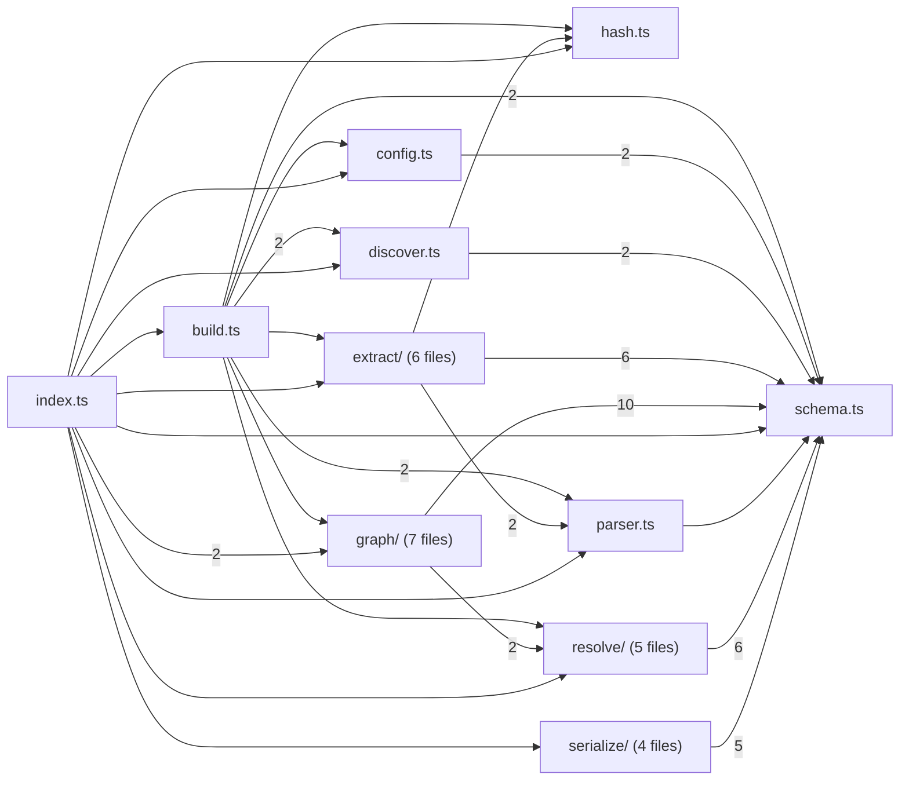
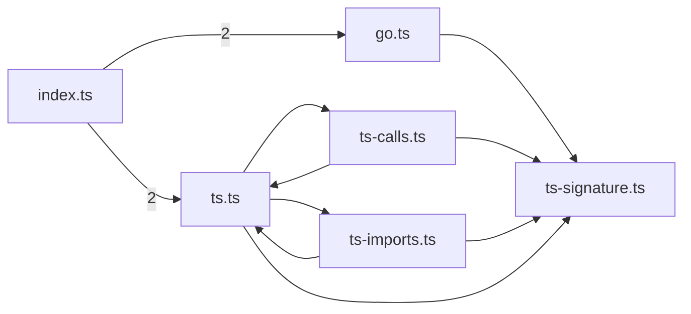
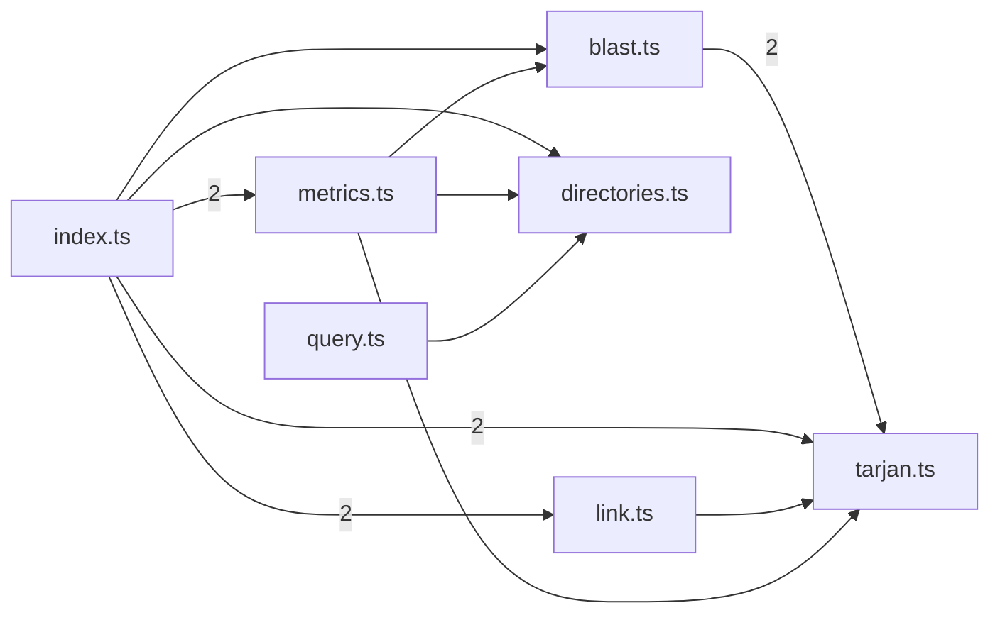
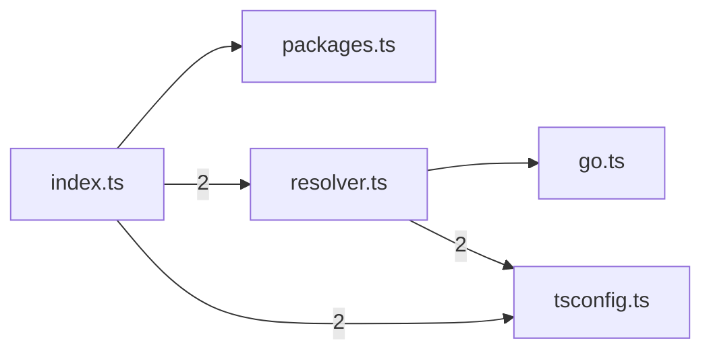
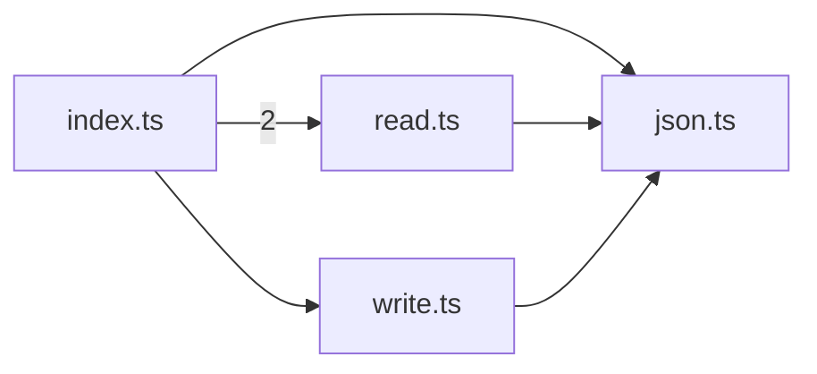

# @greplost/core

> Generated by greplost. Do not edit by hand; run `greplost update`.

Path: `packages/core` · 29 files · 5996 LOC · depends on: none · depended on by: @greplost/bench, @greplost/render, @greplost/semantic, @greplost/sync, @greplost/workspace, greplost, greplost-monorepo

## Modules

```text
└── src
    ├── extract
    │   ├── go.ts
    │   ├── index.ts
    │   ├── ts-calls.ts
    │   ├── ts-imports.ts
    │   ├── ts-signature.ts
    │   └── ts.ts
    ├── graph
    │   ├── blast.ts
    │   ├── directories.ts
    │   ├── index.ts
    │   ├── link.ts
    │   ├── metrics.ts
    │   ├── query.ts
    │   └── tarjan.ts
    ├── resolve
    │   ├── go.ts
    │   ├── index.ts
    │   ├── packages.ts
    │   ├── resolver.ts
    │   └── tsconfig.ts
    ├── serialize
    │   ├── index.ts
    │   ├── json.ts
    │   ├── read.ts
    │   └── write.ts
    ├── build.ts
    ├── config.ts
    ├── discover.ts
    ├── hash.ts
    ├── index.ts
    ├── parser.ts
    └── schema.ts
```

## Module table

| File | LOC | Exports | Fan-in | Fan-out | Blast |
|---|---|---|---|---|---|
| [`src/build.ts`](modules/src/build.ts.md) | 352 | 3 | 1 | 8 | 31 |
| [`src/config.ts`](modules/src/config.ts.md) | 136 | 2 | 2 | 1 | 32 |
| [`src/discover.ts`](modules/src/discover.ts.md) | 133 | 2 | 2 | 1 | 32 |
| [`src/extract/go.ts`](modules/src/extract/go.ts.md) | 412 | 2 | 1 | 2 | 33 |
| [`src/extract/index.ts`](modules/src/extract/index.ts.md) | 55 | 4 | 2 | 5 | 32 |
| [`src/extract/ts-calls.ts`](modules/src/extract/ts-calls.ts.md) | 84 | 3 | 1 | 2 | 35 |
| [`src/extract/ts-imports.ts`](modules/src/extract/ts-imports.ts.md) | 335 | 4 | 1 | 3 | 35 |
| [`src/extract/ts-signature.ts`](modules/src/extract/ts-signature.ts.md) | 187 | 19 | 4 | 0 | 37 |
| [`src/extract/ts.ts`](modules/src/extract/ts.ts.md) | 860 | 2 | 3 | 5 | 35 |
| [`src/graph/blast.ts`](modules/src/graph/blast.ts.md) | 112 | 2 | 2 | 2 | 45 |
| [`src/graph/directories.ts`](modules/src/graph/directories.ts.md) | 122 | 5 | 3 | 1 | 46 |
| [`src/graph/index.ts`](modules/src/graph/index.ts.md) | 14 | 18 | 10 | 5 | 43 |
| [`src/graph/link.ts`](modules/src/graph/link.ts.md) | 554 | 8 | 1 | 3 | 44 |
| [`src/graph/metrics.ts`](modules/src/graph/metrics.ts.md) | 150 | 3 | 1 | 5 | 44 |
| [`src/graph/query.ts`](modules/src/graph/query.ts.md) | 81 | 3 | 1 | 2 | 31 |
| [`src/graph/tarjan.ts`](modules/src/graph/tarjan.ts.md) | 152 | 4 | 4 | 1 | 47 |
| [`src/hash.ts`](modules/src/hash.ts.md) | 28 | 2 | 3 | 0 | 33 |
| [`src/index.ts`](modules/src/index.ts.md) | 27 | 92 | 9 | 11 | 30 |
| [`src/parser.ts`](modules/src/parser.ts.md) | 144 | 5 | 4 | 1 | 36 |
| [`src/resolve/go.ts`](modules/src/resolve/go.ts.md) | 331 | 8 | 2 | 1 | 48 |
| [`src/resolve/index.ts`](modules/src/resolve/index.ts.md) | 10 | 8 | 3 | 3 | 45 |
| [`src/resolve/packages.ts`](modules/src/resolve/packages.ts.md) | 389 | 2 | 1 | 1 | 46 |
| [`src/resolve/resolver.ts`](modules/src/resolve/resolver.ts.md) | 525 | 4 | 1 | 3 | 46 |
| [`src/resolve/tsconfig.ts`](modules/src/resolve/tsconfig.ts.md) | 316 | 3 | 2 | 0 | 47 |
| [`src/schema.ts`](modules/src/schema.ts.md) | 361 | 39 | 76 | 0 | 98 |
| [`src/serialize/index.ts`](modules/src/serialize/index.ts.md) | 4 | 6 | 1 | 3 | 31 |
| [`src/serialize/json.ts`](modules/src/serialize/json.ts.md) | 35 | 3 | 3 | 1 | 34 |
| [`src/serialize/read.ts`](modules/src/serialize/read.ts.md) | 65 | 2 | 1 | 2 | 32 |
| [`src/serialize/write.ts`](modules/src/serialize/write.ts.md) | 22 | 1 | 1 | 2 | 32 |

## Components

### packages/core (overview)


### packages/core/src (overview)



### packages/core/src/extract



### packages/core/src/graph



### packages/core/src/resolve



### packages/core/src/serialize



## External dependencies

- `fast-glob`
- `node:child_process`
- `node:crypto`
- `node:fs`
- `node:fs/promises`
- `node:module`
- `node:path`
- `node:url`
- `picomatch`
- `web-tree-sitter`
