# @greplost/render

> Generated by greplost. Do not edit by hand; run `greplost update`.

Path: `packages/render` · 13 files · 1768 LOC · depends on: @greplost/core · depended on by: @greplost/semantic, @greplost/sync, @greplost/workspace, greplost

## Modules

```text
└── src
    ├── docs
    │   ├── api.ts
    │   ├── card.ts
    │   ├── hotspots.ts
    │   ├── index-doc.ts
    │   ├── package-map.ts
    │   └── repo-map.ts
    ├── ascii.ts
    ├── index.ts
    ├── mermaid.ts
    ├── render.ts
    ├── slug.ts
    ├── split.ts
    └── tokens.ts
```

## Module table

| File | LOC | Exports | Fan-in | Fan-out | Blast |
|---|---|---|---|---|---|
| [`src/ascii.ts`](modules/src/ascii.ts.md) | 82 | 2 | 3 | 1 | 36 |
| [`src/docs/api.ts`](modules/src/docs/api.ts.md) | 176 | 8 | 2 | 2 | 35 |
| [`src/docs/card.ts`](modules/src/docs/card.ts.md) | 220 | 1 | 1 | 4 | 35 |
| [`src/docs/hotspots.ts`](modules/src/docs/hotspots.ts.md) | 90 | 5 | 2 | 4 | 35 |
| [`src/docs/index-doc.ts`](modules/src/docs/index-doc.ts.md) | 185 | 1 | 1 | 6 | 35 |
| [`src/docs/package-map.ts`](modules/src/docs/package-map.ts.md) | 140 | 2 | 1 | 6 | 35 |
| [`src/docs/repo-map.ts`](modules/src/docs/repo-map.ts.md) | 111 | 3 | 2 | 6 | 35 |
| [`src/index.ts`](modules/src/index.ts.md) | 26 | 26 | 6 | 6 | 28 |
| [`src/mermaid.ts`](modules/src/mermaid.ts.md) | 133 | 5 | 4 | 1 | 37 |
| [`src/render.ts`](modules/src/render.ts.md) | 298 | 11 | 7 | 9 | 35 |
| [`src/slug.ts`](modules/src/slug.ts.md) | 45 | 3 | 7 | 1 | 36 |
| [`src/split.ts`](modules/src/split.ts.md) | 248 | 3 | 3 | 2 | 36 |
| [`src/tokens.ts`](modules/src/tokens.ts.md) | 14 | 2 | 2 | 0 | 36 |

## Components

```mermaid
graph LR
  packages_render_src_ascii_ts["ascii.ts"]
  packages_render_src_docs_api_ts["api.ts"]
  packages_render_src_docs_card_ts["card.ts"]
  packages_render_src_docs_hotspots_ts["hotspots.ts"]
  packages_render_src_docs_index_doc_ts["index-doc.ts"]
  packages_render_src_docs_package_map_ts["package-map.ts"]
  packages_render_src_docs_repo_map_ts["repo-map.ts"]
  packages_render_src_index_ts["index.ts"]
  packages_render_src_mermaid_ts["mermaid.ts"]
  packages_render_src_render_ts["render.ts"]
  packages_render_src_slug_ts["slug.ts"]
  packages_render_src_split_ts["split.ts"]
  packages_render_src_tokens_ts["tokens.ts"]
  packages_render_src_docs_api_ts --> packages_render_src_render_ts
  packages_render_src_docs_card_ts --> packages_render_src_docs_api_ts
  packages_render_src_docs_card_ts --> packages_render_src_render_ts
  packages_render_src_docs_card_ts --> packages_render_src_slug_ts
  packages_render_src_docs_hotspots_ts --> packages_render_src_render_ts
  packages_render_src_docs_hotspots_ts --> packages_render_src_slug_ts
  packages_render_src_docs_index_doc_ts --> packages_render_src_docs_hotspots_ts
  packages_render_src_docs_index_doc_ts --> packages_render_src_docs_repo_map_ts
  packages_render_src_docs_index_doc_ts --> packages_render_src_render_ts
  packages_render_src_docs_index_doc_ts --> packages_render_src_slug_ts
  packages_render_src_docs_index_doc_ts --> packages_render_src_tokens_ts
  packages_render_src_docs_package_map_ts --> packages_render_src_ascii_ts
  packages_render_src_docs_package_map_ts -->|2| packages_render_src_mermaid_ts
  packages_render_src_docs_package_map_ts --> packages_render_src_render_ts
  packages_render_src_docs_package_map_ts --> packages_render_src_slug_ts
  packages_render_src_docs_package_map_ts -->|2| packages_render_src_split_ts
  packages_render_src_docs_repo_map_ts --> packages_render_src_ascii_ts
  packages_render_src_docs_repo_map_ts -->|2| packages_render_src_mermaid_ts
  packages_render_src_docs_repo_map_ts --> packages_render_src_render_ts
  packages_render_src_docs_repo_map_ts --> packages_render_src_slug_ts
  packages_render_src_docs_repo_map_ts -->|2| packages_render_src_split_ts
  packages_render_src_index_ts --> packages_render_src_ascii_ts
  packages_render_src_index_ts --> packages_render_src_mermaid_ts
  packages_render_src_index_ts -->|2| packages_render_src_render_ts
  packages_render_src_index_ts --> packages_render_src_slug_ts
  packages_render_src_index_ts --> packages_render_src_split_ts
  packages_render_src_index_ts --> packages_render_src_tokens_ts
  packages_render_src_render_ts --> packages_render_src_docs_api_ts
  packages_render_src_render_ts --> packages_render_src_docs_card_ts
  packages_render_src_render_ts --> packages_render_src_docs_hotspots_ts
  packages_render_src_render_ts --> packages_render_src_docs_index_doc_ts
  packages_render_src_render_ts --> packages_render_src_docs_package_map_ts
  packages_render_src_render_ts --> packages_render_src_docs_repo_map_ts
  packages_render_src_render_ts --> packages_render_src_slug_ts
  packages_render_src_split_ts -->|2| packages_render_src_mermaid_ts
```



## External dependencies

- `node:path`
