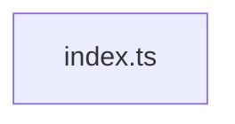

# @greplost/semantic

> Generated by greplost. Do not edit by hand; run `greplost update`.

Path: `packages/semantic` · 1 files · 2 LOC · depends on: none · depended on by: greplost

## Modules

```text
└── src
    └── index.ts
```

## Module table

| File | LOC | Exports | Fan-in | Fan-out | Blast |
|---|---|---|---|---|---|
| [`src/index.ts`](modules/src/index.ts.md) | 2 | 0 | 1 | 0 | 4 |

## Components



## External dependencies

None.
