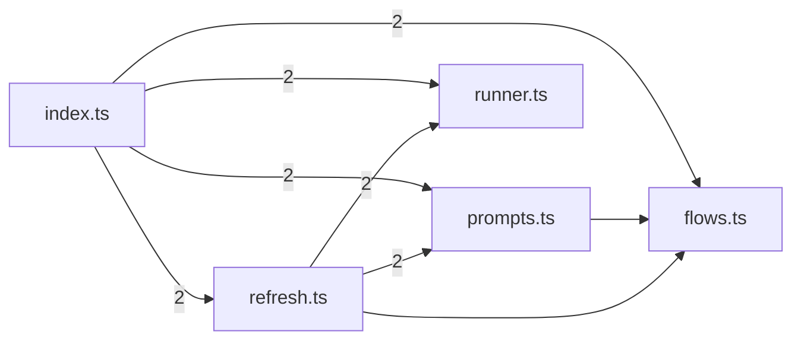

# @greplost/semantic

> Generated by greplost. Do not edit by hand; run `greplost update`.

Path: `packages/semantic` · 5 files · 1175 LOC · depends on: @greplost/core, @greplost/render, @greplost/sync · depended on by: greplost

## Modules

```text
└── src
    ├── flows.ts
    ├── index.ts
    ├── prompts.ts
    ├── refresh.ts
    └── runner.ts
```

## Module table

| File | LOC | Exports | Fan-in | Fan-out | Blast |
|---|---|---|---|---|---|
| [`src/flows.ts`](modules/src/flows.ts.md) | 215 | 10 | 3 | 2 | 7 |
| [`src/index.ts`](modules/src/index.ts.md) | 46 | 33 | 1 | 4 | 4 |
| [`src/prompts.ts`](modules/src/prompts.ts.md) | 333 | 13 | 2 | 1 | 6 |
| [`src/refresh.ts`](modules/src/refresh.ts.md) | 463 | 6 | 1 | 7 | 5 |
| [`src/runner.ts`](modules/src/runner.ts.md) | 118 | 4 | 2 | 0 | 6 |

## Components



## External dependencies

- `node:child_process`
- `node:fs`
- `node:os`
- `node:path`
