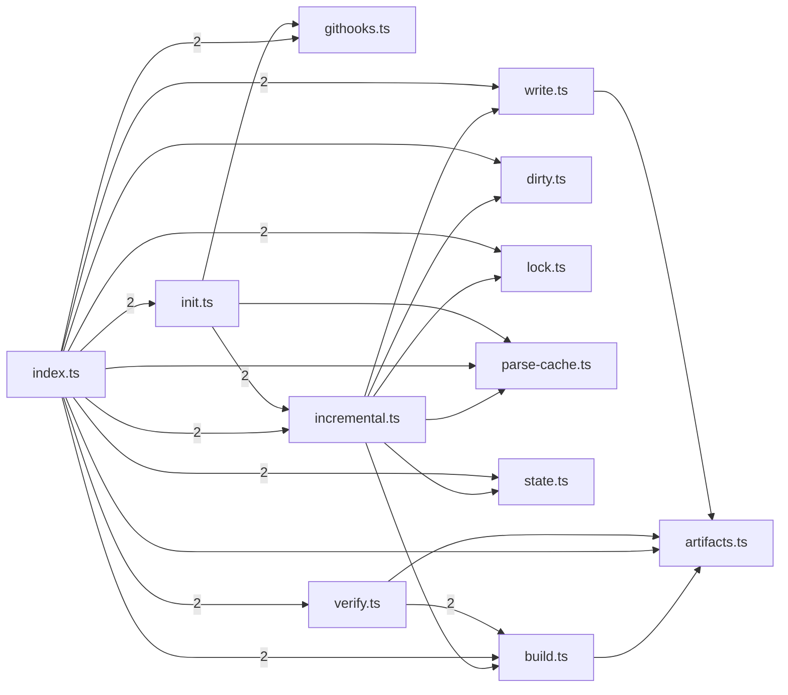

# @greplost/sync

> Generated by greplost. Do not edit by hand; run `greplost update`.

Path: `packages/sync` · 12 files · 2946 LOC · depends on: @greplost/core, @greplost/render · depended on by: @greplost/bench, @greplost/semantic, @greplost/workspace, greplost

## Modules

```text
└── src
    ├── artifacts.ts
    ├── build.ts
    ├── dirty.ts
    ├── githooks.ts
    ├── incremental.ts
    ├── index.ts
    ├── init.ts
    ├── lock.ts
    ├── parse-cache.ts
    ├── state.ts
    ├── verify.ts
    └── write.ts
```

## Module table

| File | LOC | Exports | Fan-in | Fan-out | Blast |
|---|---|---|---|---|---|
| [`src/artifacts.ts`](modules/src/artifacts.ts.md) | 174 | 3 | 4 | 1 | 22 |
| [`src/build.ts`](modules/src/build.ts.md) | 140 | 4 | 3 | 4 | 20 |
| [`src/dirty.ts`](modules/src/dirty.ts.md) | 191 | 3 | 2 | 1 | 19 |
| [`src/githooks.ts`](modules/src/githooks.ts.md) | 233 | 5 | 2 | 0 | 18 |
| [`src/incremental.ts`](modules/src/incremental.ts.md) | 575 | 3 | 2 | 8 | 18 |
| [`src/index.ts`](modules/src/index.ts.md) | 49 | 41 | 9 | 11 | 16 |
| [`src/init.ts`](modules/src/init.ts.md) | 143 | 3 | 1 | 4 | 17 |
| [`src/lock.ts`](modules/src/lock.ts.md) | 281 | 7 | 2 | 1 | 19 |
| [`src/parse-cache.ts`](modules/src/parse-cache.ts.md) | 232 | 6 | 3 | 2 | 19 |
| [`src/state.ts`](modules/src/state.ts.md) | 105 | 3 | 2 | 1 | 19 |
| [`src/verify.ts`](modules/src/verify.ts.md) | 359 | 4 | 1 | 3 | 17 |
| [`src/write.ts`](modules/src/write.ts.md) | 464 | 3 | 2 | 2 | 19 |

## Components



## External dependencies

- `node:child_process`
- `node:fs`
- `node:path`
- `node:perf_hooks`
