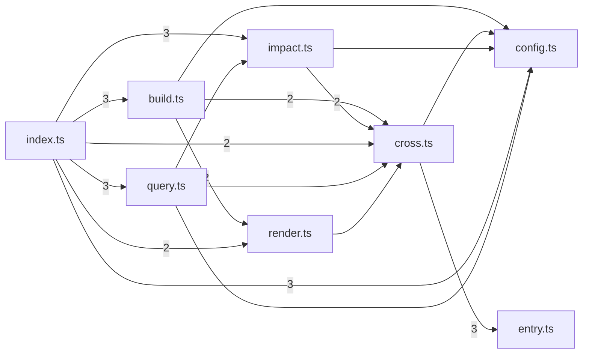

# @greplost/workspace

> Generated by greplost. Do not edit by hand; run `greplost update`.

Path: `packages/workspace` · 8 files · 1931 LOC · depends on: @greplost/core, @greplost/render, @greplost/sync · depended on by: greplost

## Modules

```text
└── src
    ├── build.ts
    ├── config.ts
    ├── cross.ts
    ├── entry.ts
    ├── impact.ts
    ├── index.ts
    ├── query.ts
    └── render.ts
```

## Module table

| File | LOC | Exports | Fan-in | Fan-out | Blast |
|---|---|---|---|---|---|
| [`src/build.ts`](modules/src/build.ts.md) | 279 | 5 | 1 | 5 | 9 |
| [`src/config.ts`](modules/src/config.ts.md) | 190 | 11 | 5 | 1 | 14 |
| [`src/cross.ts`](modules/src/cross.ts.md) | 346 | 7 | 5 | 5 | 13 |
| [`src/entry.ts`](modules/src/entry.ts.md) | 194 | 5 | 1 | 1 | 14 |
| [`src/impact.ts`](modules/src/impact.ts.md) | 194 | 5 | 2 | 4 | 10 |
| [`src/index.ts`](modules/src/index.ts.md) | 379 | 40 | 1 | 7 | 8 |
| [`src/query.ts`](modules/src/query.ts.md) | 215 | 4 | 1 | 6 | 9 |
| [`src/render.ts`](modules/src/render.ts.md) | 134 | 4 | 2 | 4 | 10 |

## Components



## External dependencies

- `node:fs`
- `node:path`
