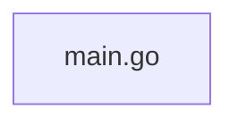

# tfinspect

> Generated by greplost. Do not edit by hand; run `greplost update`.

Path: `bench/truth/tfinspect` · 1 files · 882 LOC · depends on: none · depended on by: none

## Modules

```text
└── main.go
```

## Module table

| File | LOC | Exports | Fan-in | Fan-out | Blast |
|---|---|---|---|---|---|
| [`main.go`](modules/main.go.md) | 882 | 0 | 0 | 0 | 0 |

## Components



## External dependencies

- `encoding/json`
- `flag`
- `fmt`
- `github.com/hashicorp/hcl/v2`
- `github.com/hashicorp/hcl/v2/hclparse`
- `github.com/hashicorp/hcl/v2/hclsyntax`
- `github.com/hashicorp/terraform-config-inspect/tfconfig`
- `io/fs`
- `os`
- `path/filepath`
- `sort`
- `strings`
