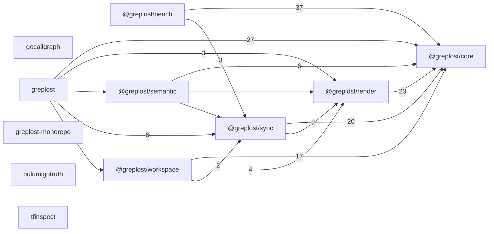

# greplost-monorepo: package map

> Generated by greplost. Do not edit by hand; run `greplost update`.

## Package tree

```text
├── bench  @greplost/bench
│   └── truth
│       ├── gocallgraph  gocallgraph
│       ├── pulumigotruth  pulumigotruth
│       └── tfinspect  tfinspect
├── packages
│   ├── cli  greplost
│   ├── core  @greplost/core
│   ├── render  @greplost/render
│   ├── semantic  @greplost/semantic
│   ├── sync  @greplost/sync
│   └── workspace  @greplost/workspace
└── .  greplost-monorepo
```

## Package dependencies



## Packages

| Package | Path | Files | LOC | Depends on | Map |
|---|---|---|---|---|---|
| greplost-monorepo | . | 4 | 363 | none | [MAP](../packages/greplost-monorepo/MAP.md) |
| @greplost/bench | bench | 50 | 27949 | @greplost/core, @greplost/sync | [MAP](../packages/greplost__bench/MAP.md) |
| gocallgraph | bench/truth/gocallgraph | 1 | 444 | none | [MAP](../packages/gocallgraph/MAP.md) |
| pulumigotruth | bench/truth/pulumigotruth | 1 | 588 | none | [MAP](../packages/pulumigotruth/MAP.md) |
| tfinspect | bench/truth/tfinspect | 1 | 882 | none | [MAP](../packages/tfinspect/MAP.md) |
| greplost | packages/cli | 23 | 3133 | @greplost/core, @greplost/render, @greplost/semantic, @greplost/sync, @greplost/workspace | [MAP](../packages/greplost/MAP.md) |
| @greplost/core | packages/core | 66 | 19861 | none | [MAP](../packages/greplost__core/MAP.md) |
| @greplost/render | packages/render | 16 | 2482 | @greplost/core | [MAP](../packages/greplost__render/MAP.md) |
| @greplost/semantic | packages/semantic | 5 | 1509 | @greplost/core, @greplost/render, @greplost/sync | [MAP](../packages/greplost__semantic/MAP.md) |
| @greplost/sync | packages/sync | 12 | 3487 | @greplost/core, @greplost/render | [MAP](../packages/greplost__sync/MAP.md) |
| @greplost/workspace | packages/workspace | 8 | 2005 | @greplost/core, @greplost/render, @greplost/sync | [MAP](../packages/greplost__workspace/MAP.md) |
