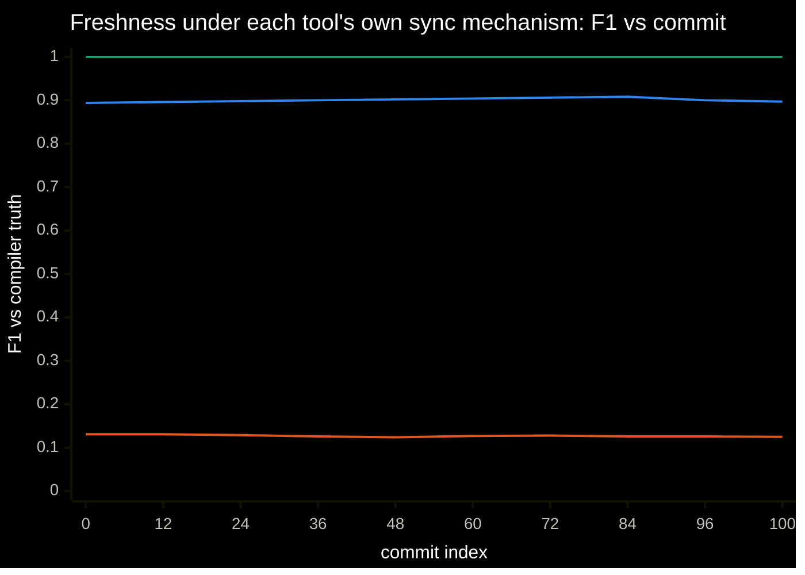
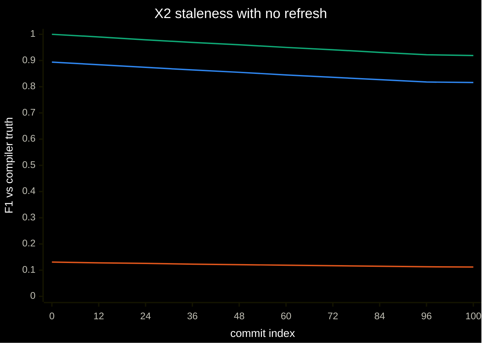
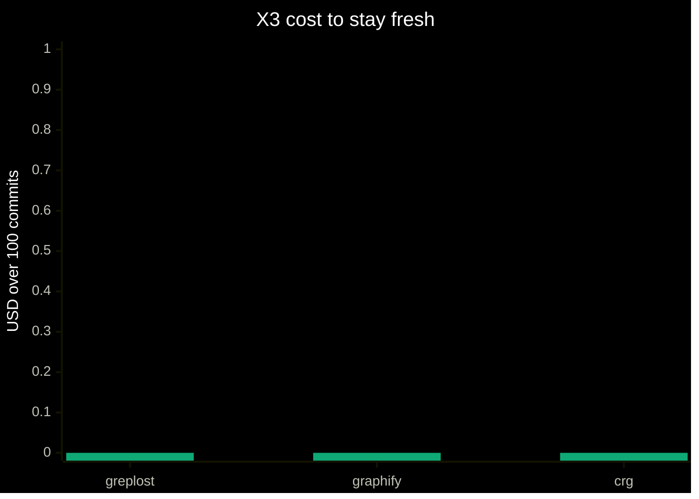
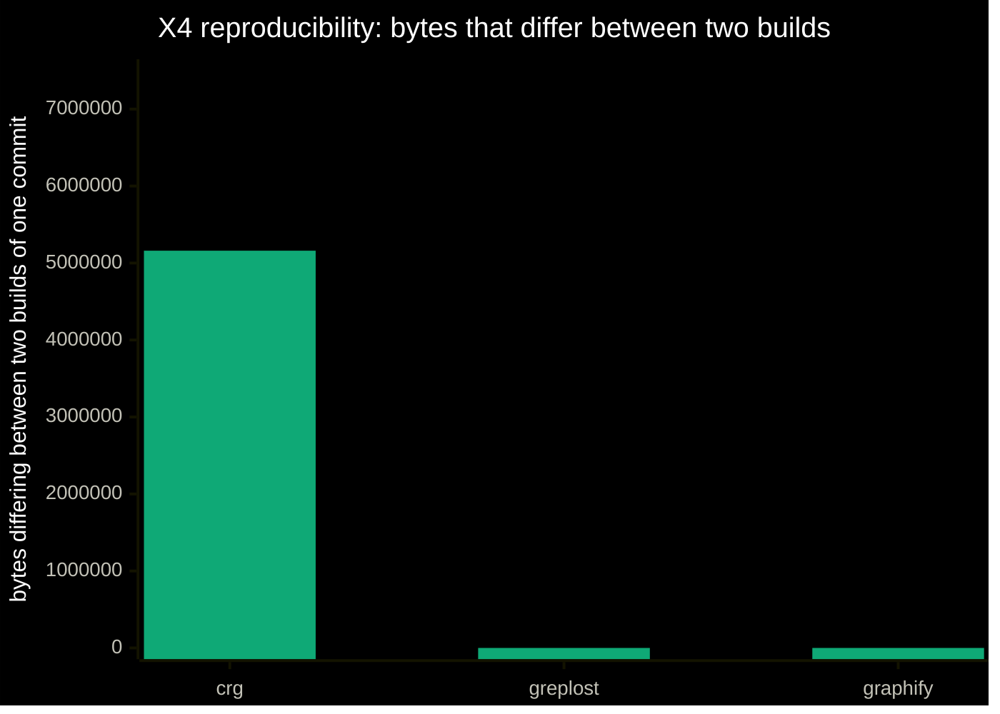
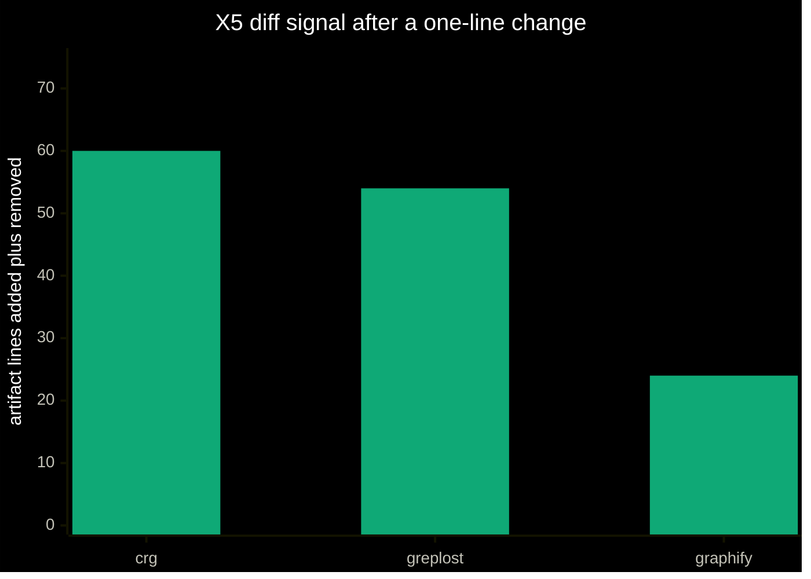
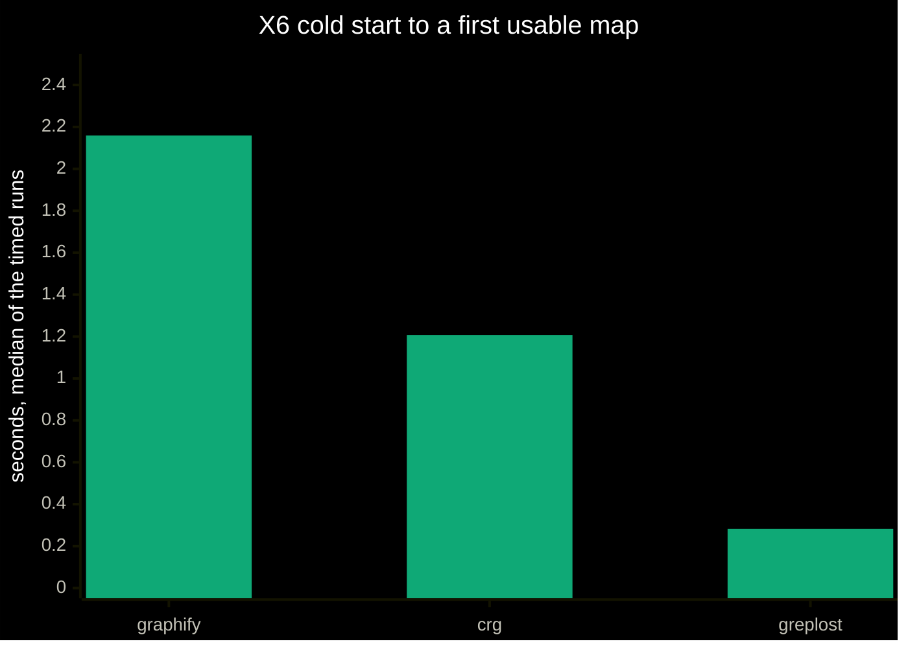
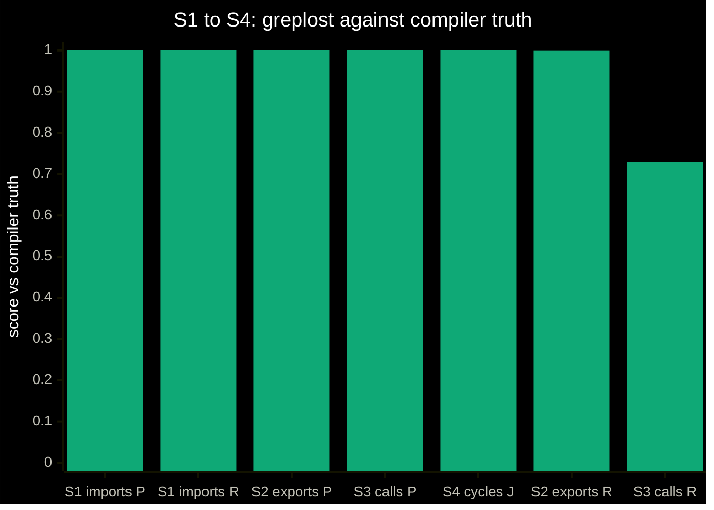
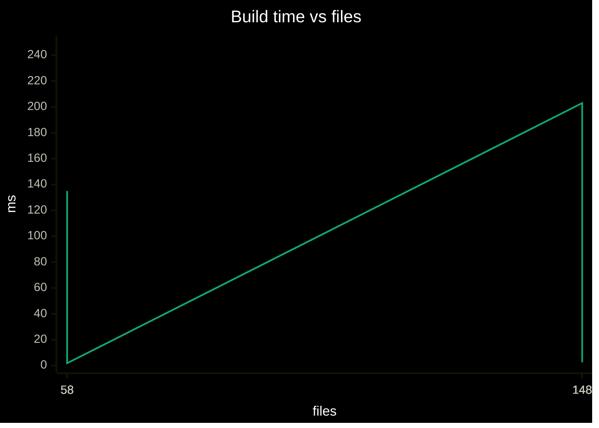

# greplost benchmark results

Generated by `bun bench/src/cli.ts report` from the newest result file of each suite in `bench/results/`. Every measured value in this file comes out of one of those payloads; nothing here is typed by hand (tech spec 10.10). A suite with no result file renders as `not run`, and a tool that could not be run renders as `n/a` with the reason, never as a zero.

Suites with no result file in `bench/results/`, rendered as `not run`: agent.

## Machine

| Field | Value |
|---|---|
| arch | arm64 |
| bun | 1.2.21 |
| cores | 16 |
| cpu | Apple M4 Max |
| go | go version go1.25.3 darwin/arm64 |
| greplostSha | 7e04594 |
| greplostVersion | 0.0.1 |
| memoryGB | 128 |
| node | 24.3.0 |
| os | Darwin 25.5.0 |

## Corpus

| Repo | Tier | Lang | Pinned SHA |
|---|---|---|---|
| anyq | S | ts | 657f41c2cbe06039c0d82cf81c17759d1149eda2 |
| gin | S | go | dcaa4296d111981ffb31ac3eba90bb63e1eb5ab9 |
| hono | M | ts | e2740d5a1bd0b4254e517e3af8b60789284bc7bd |

## Versions

| Component | Version |
|---|---|
| greplostVersion | 0.0.1 |
| greplostSha | 7e04594 |
| bun | 1.2.21 |
| node | 24.3.0 |
| go | go version go1.25.3 darwin/arm64 |
| graphify (pinned) | v0.9.53 @ 33362d9 |
| ua (pinned) | v2.9.0 @ f08763d |
| crg (pinned) | v2.3.8 @ 2c6dae3 |

## Head-to-head

greplost against Graphify, Understand-Anything and code-review-graph (tech spec 3.1, 10.0). The `vs` columns are greplost's verdict against that tool: `win` means greplost came out ahead by the metric's margin, `tie` inside it, `loss` behind it, `n/a` when the tool could not be run at all. Every loss and every `n/a` carries its reason.

- X1, X4, X5, X6: Measured 2026-09-02 at 173a463 on anyq, tier S (148 files).
- X2, X3: Measured 2026-09-02 at b908e0f on hono, tier M (248 files, 100 commits).
- X10: Measured 2026-09-02 at 7e04594.

| ID | Target | Measured | vs graphify | vs ua | vs crg | Reason on loss |
|---|---|---|---|---|---|---|
| X1 | >= +10pt calls, >= +3pt imports | calls 1 P / 0.468 R, imports 1 P / 1 R | win (calls 0.877 P / 0.096 R, imports 1 P / 0.088 R) | n/a | win (calls 0.361 P / 0.28 R, imports 1 P / 0.684 R) | greplost: gap over the best competitor is 0.123 on calls and 0 on imports; the target is +0.10 and +0.03 |
| X2 | greplost F1 >= 0.99 after 100 commits | 1 | tie (decay +0.0052 (0.131 to 0.125)) | n/a | tie (decay -0.0028 (0.894 to 0.897)) | greplost: greplost started the walk at 1 import F1 and ended at 1, a fall of 0.000. The level is coverage (X1's subject); only the fall is staleness |
| X3 | <= 1% of ua, <= 20% of graphify over 100 commits | $0, 0.299 min | win ($0, 2.365 min) | n/a | win ($0, 0.858 min) | greplost: evaluated on the graphify arm of the target only: 12.6% of graphify's wall-clock (target <= 20%). The ua arm cannot be evaluated — Understand-Anything has no headless entry point here, so no cost exists to take 1% of. |
| X4 | 0 bytes differ | 0 bytes | tie (0 bytes) | n/a | win (5160286 bytes) |  |
| X5 | <= 10 artifact lines | 54 of 10511 lines | loss (24 of 99031 lines) | n/a | win (60 of 88119 lines) | greplost: 54 artifact lines of 10511 changed across 12 files for a one-line source change; the target is 10 lines. Where: `manifest.json` 20 lines, `packages/anyq__kafka/MAP.md` 8 lines, `packages/anyq__example-retry-strategies/MAP.md` 7 lines, `packages/anyq__example-retry-strategies/modules/src/adapters/kafka.ts.md` 4 lines, and 8 more files; graphify: 24 of 99031 artifact lines changed against greplost's 54 of 10511, a quieter diff than greplost's. Where: `graphify-out/graph.json` 12 lines, `graphify-out/GRAPH_REPORT.md` 6 lines, `graphify-out/manifest.json` 6 lines |
| X6 | <= 5s and $0 (measured on anyq, tier S, not tier M) | 0.283 s ($0) | win (2.159 s) | n/a | win (1.207 s) |  |
| X7 | accuracy >= best, tool calls <= 50% of best | n/a | n/a | n/a | n/a |  |
| X8 | <= 50% of best competitor tokens | n/a | n/a | n/a | n/a |  |
| X9 | fastest, highest hit rate | n/a | n/a | n/a | n/a |  |
| X10 | works (capability, not a score) | works | n/a | n/a | n/a |  |

> Reading the X1 row: each `vs <tool>` column is greplost against that tool on **call edge precision**, the headline tech spec 10.0 names. greplost's own `Measured` verdict is against **both halves** of the 3.1 target at once (+0.10 on calls and +0.03 on imports), so it can be a `tie` in the same row where every competitor column is a `win`.

- **X1** Structural precision vs compiler truth: greplost calls 1 P / 0.468 R, imports 1 P / 1 R, graphify calls 0.877 P / 0.096 R, imports 1 P / 0.088 R, ua n/a, crg calls 0.361 P / 0.28 R, imports 1 P / 0.684 R
- **X2** Staleness after 100 replayed commits: greplost 1, graphify decay +0.0052 (0.131 to 0.125), ua n/a, crg decay -0.0028 (0.894 to 0.897)
- **X3** Cost to stay fresh over 100 replayed commits: greplost $0, 0.299 min, graphify $0, 2.365 min, ua n/a, crg $0, 0.858 min
- **X4** Reproducibility: two builds of one commit: greplost 0 bytes, graphify 0 bytes, ua n/a, crg 5160286 bytes
- **X5** Diff signal after a one-line change: greplost 54 of 10511 lines, graphify 24 of 99031 lines, ua n/a, crg 60 of 88119 lines
- **X6** Cold start to first usable map: greplost 0.283 s ($0), graphify 2.159 s, ua n/a, crg 1.207 s
- **X7** Agent structural tasks: greplost n/a, graphify n/a, ua n/a, crg n/a
- **X8** Orientation cost: greplost n/a, graphify n/a, ua n/a, crg n/a
- **X9** Reviewer task: spot the new cross-package dependency: greplost n/a, graphify n/a, ua n/a, crg n/a
- **X10** Cross-repo blast radius in workspace mode: greplost works, graphify n/a, ua n/a, crg n/a

**Why a cell is n/a**

- X1, X2, X3, X4, X5, X6 (ua): distributed only as a Claude Code plugin, and `/understand` is a multi-agent LLM pipeline: there is no headless CLI, so the only way to drive it is `claude --plugin-dir <clone>/understand-anything-plugin -p "/understand"` against a clone pinned at v2.9.0, inside the scratch HOME. That spends model tokens on every commit of every metric, so this harness does not run it and never installs the plugin into the machine’s real Claude Code configuration
- X7, X8, X9 (greplost, graphify, ua, crg): not selected by --metrics
- X10 (graphify): no cross-repo blast radius: `graphify merge-graphs` can union two graph.json files after the fact, but nothing resolves an import from one repo to a definition in another, so a merged graph has two disconnected components
- X10 (ua): no cross-repo mode: `/understand` analyses one project directory and writes one `.ua/knowledge-graph.json` anchored at it; a second repo would need a second run and there is no edge type joining them
- X10 (crg): `crg-daemon` watches several repositories, but each keeps its own SQLite graph and the resolver never crosses a repository boundary, so `code-review-graph` can answer 'who calls this' only within one repo

> X10 (greplost): `greplost init --workspace --no-hooks` then `greplost impact repo-a/src/greet.ts --json` on a copy of `fixtures/two-repo-workspace` returned 3 affected files, 2 of them in `repo-b` — the blast radius crossed the repository boundary, which is the capability tech spec 3.1 X10 asks for. It is not a score: no competitor has an equivalent to compare it against.
> X10: a capability row, not a score (tech spec 3.1). Each competitor's cell says what it would need to do this.
> graphify sync mechanism (X2, from bench/competitors.json): git hooks.
> ua sync mechanism (X2, from bench/competitors.json): git post-commit hook, opt-in.
> crg sync mechanism (X2, from bench/competitors.json): platform hooks plus a watcher.
> X2: the commit walk is **synthetic**. It is generated over the corpus repo's pinned checkout rather than replayed from its real history: each commit appends exactly one resolvable import line to one file, so truth moves by exactly one edge per commit, and the walk contains no deletions, no renames and no new files — the easy direction for an incremental updater. Tech spec 10.0 X2 asks for 500 real commits of a corpus checkout; that is not what was run.
> Mechanical staleness check (tech spec 10.0 X2): greplost has `verify` (byte comparison against a rebuild, exit 1 on drift). None of the three competitors ships an equivalent: their artifacts are refreshed, never checked.
> graphify: run through `graphify update .` (the documented no-LLM rebuild) rather than the `/graphify .` slash command, which needs a model; graph.html is excluded from the byte comparison because it is a viewer, not the graph. `graphify hook install` is run in X2's documented-sync arm, where the hooks it writes go into the repo copy's own .git/hooks; `graphify install`, which writes a global CLAUDE.md section and a Claude Code PreToolUse hook, is not run.
> graphify: every command ran with HOME=bench/.competitors/home (XDG and CLAUDE_CONFIG_DIR pointed inside it), so nothing it writes outside the repo copy reaches the machine's real configuration.
> ua: N/A — distributed only as a Claude Code plugin, and `/understand` is a multi-agent LLM pipeline: there is no headless CLI, so the only way to drive it is `claude --plugin-dir <clone>/understand-anything-plugin -p "/understand"` against a clone pinned at v2.9.0, inside the scratch HOME. That spends model tokens on every commit of every metric, so this harness does not run it and never installs the plugin into the machine’s real Claude Code configuration.
> crg: `build` + `visualize --format json` produce the artifact; `graph.db` is excluded from the byte comparison because a SQLite page layout is not the tool's output contract. `code-review-graph install` runs only in X2's documented-sync arm and only with HOME, XDG_* and CLAUDE_CONFIG_DIR pointed inside bench/.competitors/home.
> crg: every command ran with HOME=bench/.competitors/home (XDG and CLAUDE_CONFIG_DIR pointed inside it), so nothing it writes outside the repo copy reaches the machine's real configuration.
> X2: the walk is 100 synthetic commits over hono, each adding one resolvable import line, scored every 12 commits against compiler truth at that commit.
> X2: the plotted number is import edge F1 against compiler truth at that commit, and the curve starts at commit 0 with each tool's freshly built artifact. The **level** of a line is that tool's import coverage, not its freshness: the four tools do not model imports alike, and X1 measures how far apart they start (on this corpus graphify recalls a small fraction of the import edges the compiler sees). The **fall** of a line between commit 0 and the last commit is the staleness this metric is about, and it is reported as `decay` in every cell. A reader comparing two end-points is comparing coverage plus decay; only the decay belongs to X2. Call F1 is in each cell's detail.
> X2 arm `documented-sync` (`syncF1@<commit>` in each cell's detail): each tool's own sync mechanism was installed exactly as its README describes and then left alone: the harness commits, and nothing else.
> X2 arm `staleF1@<commit>`: each tool's commit-0 artifact scored against truth at that commit — the curve a reader gets when a sync mechanism is absent or does not fire. greplost is the only one of the four whose `verify` reports that state at all; the others refresh without ever checking.
> X2 sync (greplost): installed with `greplost init`; hook at `.git/hooks/post-commit`; observed to run on 100 of 100 commits (17.92 s of child-process wall-clock in total). the hook resolves `greplost` through PATH and backgrounds `greplost update --incremental --quiet`; a PATH shim in front of it writes a start and an end line per invocation, so a commit's rebuild is waited for rather than slept on, and its wall-clock is the child process's own.
> X2 sync (graphify): installed with `graphify update .` + `graphify hook install`; hook at `.git/hooks/post-commit`; observed to run on 100 of 100 commits (141.89 s of child-process wall-clock in total). `graphify hook install` writes a post-commit hook that launches a detached python rebuild without going through the `graphify` launcher, so a PATH shim cannot see it: the rebuild is observed instead through the hook's own log under the sandbox HOME (`.cache/graphify-rebuild.log`, one line per rebuild) and waited for until the detached process is gone, which is what its wall-clock is measured over. That window starts when the commit returns rather than when the hook launched the child, so graphify's number is a slight under-count — the direction that flatters graphify, not greplost.
> X2 sync (crg): installed with `code-review-graph install` + `code-review-graph build` + `code-review-graph visualize --format json`; hook at `.git/hooks/pre-commit`; observed to run on 100 of 100 commits (51.45 s of child-process wall-clock in total). `code-review-graph install` writes a pre-commit hook that runs `code-review-graph update` synchronously and resolves the binary through PATH, so a PATH shim in front of it records a start and an end line per commit; the hook runs `update` and then `detect-changes --brief`, and both are counted because both are what a commit costs a crg user; it does not run `visualize`, so no export is inside its timing.
> X2: how much of the gap is coverage and how much is staleness — graphify: end-point gap 0.875, of which 0.869 was already there at commit 0 (coverage) and 0.005 is the difference in decay; crg: end-point gap 0.103, of which 0.106 was already there at commit 0 (coverage) and -0.003 is the difference in decay. X1 is where a coverage difference belongs; X2 is only the fall.
> X3: every tool's wall-clock is the run time of the child processes its own commit-time mechanism started, interpreter startup included, measured the same way for greplost as for the competitors. crg's `visualize --format json` export is outside that number: its hook does not run it, and it is invoked by this suite only at scoring checkpoints, because greplost has no export step to charge against it.
> X3: every tool that ran here ran its no-LLM path, so USD is 0 for all of them and the verdict falls to wall-clock. That is not the tech spec's comparison, which costs each tool's *documented* refresh: graphify's `/graphify` first pass and Understand-Anything's `/understand` are LLM pipelines whose USD this harness cannot measure without model credentials. The zero is what was measured, not a claim that their documented path is free.
> X1: both sides restricted to the 148 files the TypeScript compiler loaded, and both scored over every edge each tool emits at any confidence. The confidence=high arm (greplost's S3 gate, graphify's and crg's `EXTRACTED` tier) is reported beside it in each cell's detail; scoring greplost at high while scoring a competitor at every confidence would flatter greplost on precision by construction.
> X4: every tool is built twice on the same tree, each build in its own process, and the differing bytes of its documented artifact files are counted after trimming the common prefix and suffix (an upper bound on the edit distance, exact for a single contiguous change). greplost is compared over the structure artifacts `listStructurePaths` enumerates; viewer and database files are excluded per competitor, and each cell's `caveat` says which.
> X5: the one-line change is `import "./kafka.js";` appended to `apps/examples/retry-strategies/src/adapters/nats.ts`, adding the edge apps/examples/retry-strategies/src/adapters/nats.ts -> apps/examples/retry-strategies/src/adapters/kafka.ts.
> X5: lines changed is added plus removed lines from a line-level longest-common-subsequence per artifact file (multiset difference above 4000 lines).
> X5 readability (tech spec 10.0's "can a human read the architectural change from the diff alone"): greplost added a line naming both the importer and the imported module; graphify, crg did not, so the new edge is not legible in the diff at any length.
> X6: timed from a fresh copy of the repo (no cache, no artifact) to the tool's own first usable output, 3 runs each, median reported and the spread in each cell's detail, every tool in its own child process so interpreter startup is counted for all of them. greplost's command is `greplost init --no-hooks` and its USD is 0; a competitor's documented first pass may cost model tokens, and where the no-LLM path was used instead the cell's caveat says so.

**X2 (hero chart): freshness under each tool's own sync mechanism over a synthetic commit walk, F1 vs commit**

**X2 companion: the same artifacts, never updated**

**Cost to stay fresh against freshness, one dot per tool**

_Mermaid's `xychart-beta` has no scatter form, so this quadrant has no inline fence: the numbers behind it are the X2 and X3 rows of the table above._

**Cold start against call graph accuracy, one dot per tool**

_Mermaid's `xychart-beta` has no scatter form, so this quadrant has no inline fence: the numbers behind it are the X1 and X6 rows of the table above._

**X1 precision per tool per edge kind**

```mermaid
%%{init: {"theme": "dark", "themeVariables": {"xyChart": {"backgroundColor": "#000000", "titleColor": "#ffffff", "xAxisLabelColor": "#c3c2b7", "yAxisLabelColor": "#c3c2b7", "xAxisTitleColor": "#ffffff", "yAxisTitleColor": "#ffffff", "plotColorPalette": "#0fa976,#e0561c,#2f86ef"}}}}%%
xychart-beta
    title "X1 structural precision vs compiler truth"
    x-axis ["call edges", "import edges"]
    y-axis "precision vs compiler truth" 0 --> 1
    bar [1, 1]
    bar [0.877, 1]
    bar [0.361, 1]
    %% series, in order: greplost, graphify, crg
    %% omitted (no data, or a gap Mermaid cannot draw): ua
    %% Precision by edge kind, every confidence; higher is better. Corpus anyq, tier S (148 files).
    %% A dashed stub is a tool that could not be run; see the reason column. Measured on corpus anyq, tier S (148 files).
```

**X3 cost per tool**

**X4 bytes that differ between two builds of one commit**

**X5 artifact lines changed by a one-line source change**

**X6 cold start to a first usable map**

## Single-tool

greplost measured against its own section 3 targets, one row per metric id. The measured column is filled from `bench/results/*.json` by the harness and is never typed by hand (tech spec 10.10); a metric whose suite has not run says `not run` rather than carrying a placeholder.

| ID | Metric | Target | Measured | Source |
|---|---|---|---|---|
| S1 | import edge precision / recall | >= 0.99 / >= 0.97 | 1 / 1 | Eval 1, `structural` (hono (248 files)) |
| S2 | export precision / recall | >= 0.99 / >= 0.99 | 1 / 0.999 | Eval 1, `structural` (hono (248 files)) |
| S3 | call edge precision (confidence=high) | >= 0.95 | 1 | Eval 1, `structural` (hono (248 files)) |
| S4 | import cycle Jaccard | = 1.00 | 1 | Eval 1, `structural` (hono (248 files)) |
| unparsable | files whose tree-sitter parse is broken at the root level | 0 | 5 | Eval 1, `structural` |
| F1 | `verify` catch rate on stale maps | 100% | 100% | Eval 2, `replay` |
| F2 | `verify` false positives after `update` | 0% (byte-identical) | 0% | Eval 2, `replay` |
| P1 | full build, 1k / 10k files | <= 1s / <= 10s (measured on anyq, tier S, 148 files) | 203 ms (p50) | Bench 3, `perf` |
| P2 | incremental update p95, 1k / 10k files | <= 500ms / <= 1s (measured on anyq, tier S, 148 files) | 145 ms | Bench 3, `perf` |
| P3 | peak RSS at 10k files | <= 500MB (reported) (measured on anyq, tier S, 148 files) | 229.9 MB | Bench 3, `perf` |
| M1 | INDEX.md token budget | <= 3000 tokens at 10k files (measured on greplost, 120 files) | 777 tokens | Map quality, `mapquality` |
| M2 | diagrams exceeding the node cap after auto-split | 0 | 0 | Map quality, `mapquality` |
| A1 | agent tokens per task vs baseline (median) | <= 50% | not run | Eval 4, `agent` |
| A2 | agent tool calls per task vs baseline | <= 40% | not run | Eval 4, `agent` |
| A3 | agent answer accuracy vs baseline | non-inferior; +10pt on blast radius | not run | Eval 4, `agent` |
| A4 | agent wall-clock per task vs baseline | <= 60% | not run | Eval 4, `agent` |

> F2 rests on 1 full-vs-incremental comparison over a walk of 100 commits. It compares the structure artifacts that `listStructurePaths` enumerates — `INDEX.md`, `manifest.json`, `graph/*.jsonl`, `repo/*.md`, `packages/*/{MAP,API}.md` and `packages/*/modules/**` — and not the whole `.greplost/` directory: `config.json`, `cache/` and the runtime files (`.dirty`, `.lock`, `.state.json`) are excluded, because they are not the map and are not committed (ruling 2026-09-02).

> `unparsable` counts files whose tree-sitter parse root is an ERROR node or has one as a direct child: the top level of the file is not a program the grammar recognises (`findUnparsableFiles` in `@greplost/core`, Appendix C ruling 2026-09-03). The extractor recovers around ERROR nodes, so these files are still scored — which is the problem: whatever the grammar could not read costs S1 and S2 recall with no line saying so unless it is counted here. tree-sitter-typescript 0.23.2 is the newest grammar that exists, and hono's generic call signatures hit open upstream issue https://github.com/tree-sitter/tree-sitter-typescript/issues/335. The count is read from the structural payload when it reports one, and otherwise derived from it — a file every one of whose truth items was missed is a file nothing was extracted from — and it is `n/a` with `not measured` when the payload carries neither. Nothing about it is asserted here.

> Rows reading `not run` have no result file behind them, not a value of zero; the section below each metric names the command that would produce one.

## Eval 1

Structural accuracy vs compiler truth (S1 to S4)

Measured 2026-09-02 at b5fca0d.

### hono (248 files)

| ID | Metric | Target | Measured | Detail |
|---|---|---|---|---|
| S1 | import edge precision / recall | >= 0.99 / >= 0.97 | 1 / 1 | tp 571, fp 0, fn 0 |
| S2 | export precision / recall | >= 0.99 / >= 0.99 | 1 / 0.999 | tp 1044, fp 0, fn 1 |
| S3 | call edge precision (confidence=high) | >= 0.95 | 1 | recall 0.73, tp 665, fp 0, fn 246; all confidences: precision 1, recall 0.778 |
| S4 | import cycle Jaccard | = 1.00 | 1 |  |

**S1 to S4 against compiler truth (greplost only)**

## Eval 2

Freshness and sync under commit replay (F1, F2)

Measured 2026-09-02 at 334b337.

| ID | Metric | Target | Measured | Detail |
|---|---|---|---|---|
| F1 | `verify` catch rate on stale maps | 100% | 100% | 82 of 82 injected drifts caught |
| F2 | `verify` false positives after `update` | 0% (byte-identical) | 0% | 0 of 1 full-vs-incremental comparisons differed; compared over the structure artifacts only (`listStructurePaths`), not the whole `.greplost/` |

> Replay length: 100 commits, 17 of them no-ops; incremental update p50 129 ms, p95 164 ms.

## Bench 3

Performance (P1 to P3)

Measured 2026-09-02 at 334b337.

| ID | Metric | Target | Measured | Detail |
|---|---|---|---|---|
| P1 | full build, 1k / 10k files | <= 1s / <= 10s | 203 ms (p50) | scenario `anyq full`, 148 files |
| P2 | incremental update p95, 1k / 10k files | <= 500ms / <= 1s | 145 ms | scenario `anyq incremental-1`, p50 131 ms |
| P3 | peak RSS at 10k files | <= 500MB (reported) | 229.9 MB | highest `maxRSS` across the scenarios below |

### every scenario

| ID | Metric | Target | Measured | Detail |
|---|---|---|---|---|
| P- | anyq full | - | 203 ms (p50) | p95 216 ms, RSS 229.9 MB |
| P- | anyq incremental-1 | - | 131 ms (p50) | p95 145 ms, RSS 140.6 MB |
| P- | anyq incremental-10 | - | 144 ms (p50) | p95 153 ms, RSS 198.7 MB |
| P- | anyq package-rename | - | 126 ms (p50) | p95 134 ms, RSS 111.9 MB |
| P- | anyq parse-cache-save | - | 2.507 ms (p50) | p95 2.968 ms, RSS 73.4 MB |
| P- | gin full | - | 135 ms (p50) | p95 149 ms, RSS 196.5 MB |
| P- | gin incremental-1 | - | 92 ms (p50) | p95 100 ms, RSS 120.2 MB |
| P- | gin incremental-10 | - | 101 ms (p50) | p95 118 ms, RSS 158.3 MB |
| P- | gin package-rename | - | 81 ms (p50) | p95 90 ms, RSS 92.1 MB |
| P- | gin parse-cache-save | - | 1.814 ms (p50) | p95 2.169 ms, RSS 71.3 MB |

**Latency per scenario (box spans p50 to p95)**

```mermaid
%%{init: {"theme": "dark", "themeVariables": {"xyChart": {"backgroundColor": "#000000", "titleColor": "#ffffff", "xAxisLabelColor": "#c3c2b7", "yAxisLabelColor": "#c3c2b7", "xAxisTitleColor": "#ffffff", "yAxisTitleColor": "#ffffff", "plotColorPalette": "#0fa976,#e0561c,#2f86ef"}}}}%%
xychart-beta
    title "P2 latency per scenario"
    x-axis ["anyq full", "anyq incremental-1", "anyq incremental-10", "anyq package-rename", "anyq parse-cache-save", "gin full", "gin incremental-1", "gin incremental-10", "gin package-rename", "gin parse-cache-save"]
    y-axis "ms" 0 --> 250
    bar [203, 131, 144, 126, 2.507, 135, 92, 101, 81, 1.814]
    bar [216, 145, 153, 134, 2.968, 149, 100, 118, 90, 2.169]
    %% series, in order: p50, p95
```

**Build time vs files**

## Eval 4

Agent navigation benchmark (A1 to A4)

not run.

> Run `bun bench/src/cli.ts agent --repo <name> --condition gl --runs 5` to fill this section (it costs money).

## Eval 5

Human navigation study (H1, H2)

| ID | Metric | Target | Measured | Detail |
|---|---|---|---|---|
| H1 | time to correct answer, with vs without | <= 60% (median) | not run |  |
| H2 | wrong-answer rate, with vs without | lower | not run |  |

> The human navigation study (tech spec 10.7) has no harness: it needs participants, and its results arrive as an anonymised CSV. Nothing in `bench/results/` can fill these rows, so they stay `not run` until a study is conducted. X9 in the head-to-head table depends on the same study.

## Map quality

INDEX.md budget and diagram size (M1, M2)

Measured 2026-09-02 at dc3d859 on greplost (120 files).

| ID | Metric | Target | Measured | Detail |
|---|---|---|---|---|
| M1 | INDEX.md token budget | <= 3000 tokens at 10k files | 777 tokens | cl100k_base |
| M2 | diagrams exceeding the node cap after auto-split | 0 | 0 | largest fence 25 nodes, cap 25, 18 fences |

> M2 has no headroom: the largest fence is 25 nodes against a cap of 25. The metric passes — nothing exceeds the cap — but one more node in that diagram fails it, so the auto-split is at its limit rather than comfortably inside it.

> Artifact dir: `.greplost`. Mermaid checker: `mermaid`.
