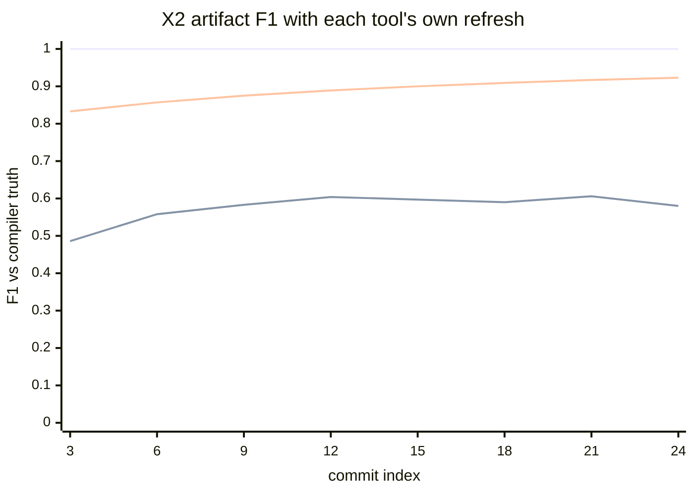
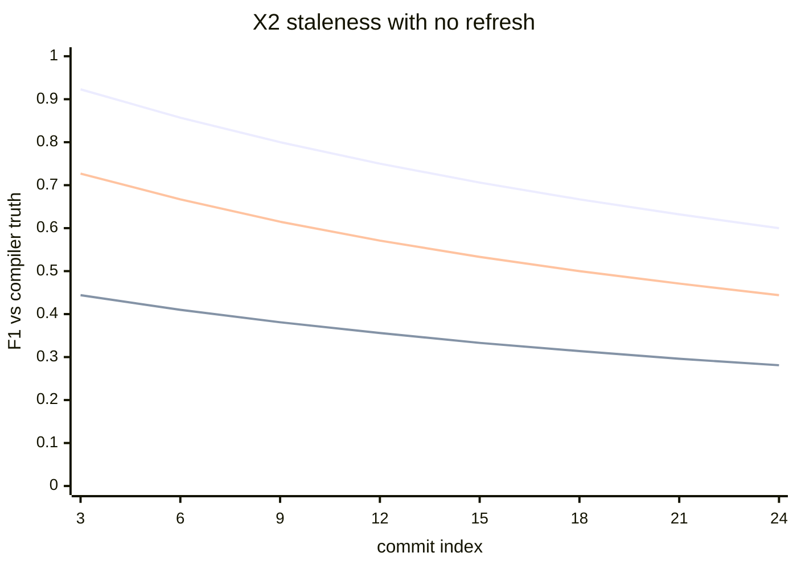
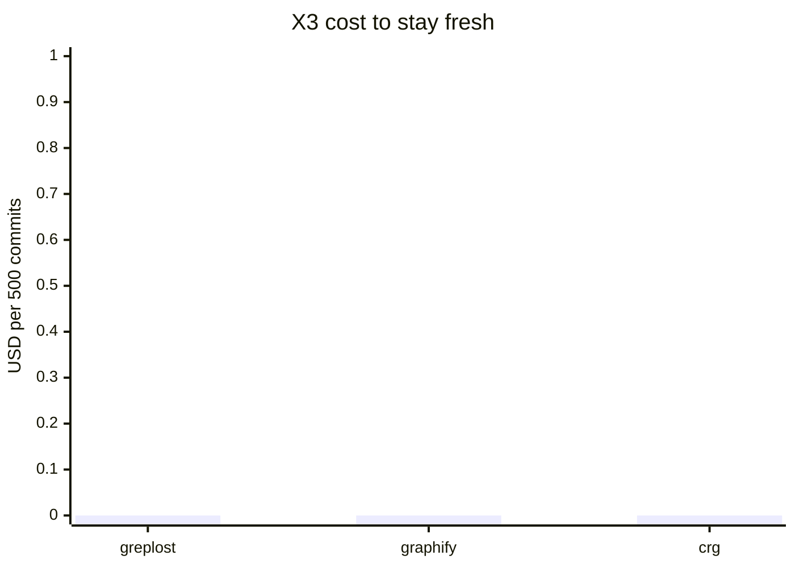

# greplost benchmark results

Generated by `bun bench/src/cli.ts report` from the newest result file of each suite in `bench/results/`. Every measured value in this file comes out of one of those payloads; nothing here is typed by hand (tech spec 10.10). A suite with no result file renders as `not run`, and a tool that could not be run renders as `n/a` with the reason, never as a zero.

Suites with no result file in `bench/results/`, rendered as `not run`: replay, perf, agent, mapquality.

## Machine

| Field | Value |
|---|---|
| arch | arm64 |
| bun | 1.2.21 |
| cores | 16 |
| cpu | Apple M4 Max |
| go | go version go1.25.3 darwin/arm64 |
| greplostSha | ac3bcd1 |
| greplostVersion | 0.0.1 |
| memoryGB | 128 |
| node | 24.3.0 |
| os | Darwin 25.5.0 |

## Corpus

| Repo | Tier | Lang | Pinned SHA |
|---|---|---|---|
| anyq | - | - | 657f41c2cbe06039c0d82cf81c17759d1149eda2 |
| tiny-ts | - | - | - |

## Versions

| Component | Version |
|---|---|
| greplostVersion | 0.0.1 |
| greplostSha | ac3bcd1 |
| bun | 1.2.21 |
| node | 24.3.0 |
| go | go version go1.25.3 darwin/arm64 |
| graphify (pinned) | v0.9.53 @ 33362d9 |
| ua (pinned) | v2.9.0 @ f08763d |
| crg (pinned) | v2.3.8 @ 2c6dae3 |

## Head-to-head

greplost against Graphify, Understand-Anything and code-review-graph (tech spec 3.1, 10.0). The `vs` columns are greplost's verdict against that tool: `win` means greplost came out ahead by the metric's margin, `tie` inside it, `loss` behind it, `n/a` when the tool could not be run at all. Every loss and every `n/a` carries its reason.

Measured 2026-09-02 at ac3bcd1.

| ID | Target | Measured | vs graphify | vs ua | vs crg | Reason on loss |
|---|---|---|---|---|---|---|
| X1 | >= +10pt calls, >= +3pt imports | calls 1 P / 0.75 R, imports 1 P / 1 R | tie (calls 1 P / 0.625 R, imports 0.533 P / 0.444 R) | n/a | win (calls 0.833 P / 0.625 R, imports 1 P / 0.667 R) |  |
| X2 | greplost F1 >= 0.99 | 1 | win (0.58) | n/a | win (0.923) |  |
| X3 | <= 1% of ua, <= 20% of graphify | $0, 0.028 min | win ($0, 0.068 min) | n/a | win ($0, 0.113 min) |  |
| X4 | 0 bytes differ | 0 bytes | tie (0 bytes) | n/a | win (79098 bytes) |  |
| X5 | <= 10 artifact lines | 40 of 902 lines | win (251 of 2722 lines) | n/a | win (352 of 1546 lines) | greplost: 40 artifact lines of 902 changed across 8 files for a one-line source change; the target is 10 lines |
| X6 | <= 5s and $0 (tier M) | 0.102 s ($0) | tie (0.17 s) | n/a | win (0.385 s) |  |
| X7 | accuracy >= best, tool calls <= 50% of best | n/a | n/a | n/a | n/a |  |
| X8 | <= 50% of best competitor tokens | n/a | n/a | n/a | n/a |  |
| X9 | fastest, highest hit rate | n/a | n/a | n/a | n/a |  |
| X10 | works (capability, not a score) | n/a | n/a | n/a | n/a |  |

- **X1** Structural precision vs compiler truth: greplost calls 1 P / 0.75 R, imports 1 P / 1 R, graphify calls 1 P / 0.625 R, imports 0.533 P / 0.444 R, ua n/a, crg calls 0.833 P / 0.625 R, imports 1 P / 0.667 R
- **X2** Staleness after 500 replayed commits: greplost 1, graphify 0.58, ua n/a, crg 0.923
- **X3** Cost to stay fresh over 500 commits: greplost $0, 0.028 min, graphify $0, 0.068 min, ua n/a, crg $0, 0.113 min
- **X4** Reproducibility: two builds of one commit: greplost 0 bytes, graphify 0 bytes, ua n/a, crg 79098 bytes
- **X5** Diff signal after a one-line change: greplost 40 of 902 lines, graphify 251 of 2722 lines, ua n/a, crg 352 of 1546 lines
- **X6** Cold start to first usable map: greplost 0.102 s ($0), graphify 0.17 s, ua n/a, crg 0.385 s
- **X7** Agent structural tasks: greplost n/a, graphify n/a, ua n/a, crg n/a
- **X8** Orientation cost: greplost n/a, graphify n/a, ua n/a, crg n/a
- **X9** Reviewer task: spot the new cross-package dependency: greplost n/a, graphify n/a, ua n/a, crg n/a
- **X10** Cross-repo blast radius in workspace mode: greplost n/a, graphify n/a, ua n/a, crg n/a

**Why a cell is n/a**

- X1, X2, X3, X4, X5, X6 (ua): distributed only as a Claude Code plugin, and `/understand` is a multi-agent LLM pipeline: there is no headless CLI, so the only way to drive it is `claude --plugin-dir <clone>/understand-anything-plugin -p "/understand"` against a clone pinned at v2.9.0, inside the scratch HOME. That spends model tokens on every commit of every metric, so this harness does not run it and never installs the plugin into the machine’s real Claude Code configuration
- X7, X8 (greplost, graphify, ua, crg): the agent suite (Eval 4) has not produced a result yet; run `bench agent` (it costs money)
- X9 (greplost, graphify, ua, crg): the reviewer task lives in the human navigation study (tech spec 10.7), which needs participants; no study has been run, so there is nothing to report for any tool
- X10 (greplost): workspace mode (tech spec 4.4) is not available in this checkout yet: `greplost workspace` is not a command; the `two-repo-workspace` fixture does not exist
- X10 (graphify): no cross-repo blast radius: `graphify merge-graphs` can union two graph.json files after the fact, but nothing resolves an import from one repo to a definition in another, so a merged graph has two disconnected components
- X10 (ua): no cross-repo mode: `/understand` analyses one project directory and writes one `.ua/knowledge-graph.json` anchored at it; a second repo would need a second run and there is no edge type joining them
- X10 (crg): `crg-daemon` watches several repositories, but each keeps its own SQLite graph and the resolver never crosses a repository boundary, so `code-review-graph` can answer 'who calls this' only within one repo

> graphify: run through `graphify update .` (the documented no-LLM rebuild) rather than the `/graphify .` slash command, which needs a model; graph.html is excluded from the byte comparison because it is a viewer, not the graph.
> graphify: every command ran with HOME=bench/.competitors/home (XDG and CLAUDE_CONFIG_DIR pointed inside it), so nothing it writes outside the repo copy reaches the machine's real configuration.
> ua: N/A — distributed only as a Claude Code plugin, and `/understand` is a multi-agent LLM pipeline: there is no headless CLI, so the only way to drive it is `claude --plugin-dir <clone>/understand-anything-plugin -p "/understand"` against a clone pinned at v2.9.0, inside the scratch HOME. That spends model tokens on every commit of every metric, so this harness does not run it and never installs the plugin into the machine’s real Claude Code configuration.
> crg: `code-review-graph install` is not run: it writes MCP config and hooks into every AI coding tool it detects on the machine. `build` + `visualize --format json` produce the same artifact. `graph.db` is excluded from the byte comparison because a SQLite page layout is not the tool's output contract.
> crg: every command ran with HOME=bench/.competitors/home (XDG and CLAUDE_CONFIG_DIR pointed inside it), so nothing it writes outside the repo copy reaches the machine's real configuration.
> X1: both sides restricted to the 12 files the TypeScript compiler loaded, and both scored over every edge each tool emits at any confidence. The confidence=high arm (greplost's S3 gate, graphify's and crg's `EXTRACTED` tier) is reported beside it in each cell's detail; scoring greplost at high while scoring a competitor at every confidence would flatter greplost on precision by construction.
> X2: the walk is 24 synthetic commits over tiny-ts, each adding one resolvable import line, scored every 3 commits against compiler truth at that commit.
> X2: the plotted number is import edge F1 against compiler truth at that commit. Imports are the one relationship all four tools model the same way and the one a fresh greplost build already scores 1.0 on, so a fall in the line is drift and not a modelling difference; call F1 is in each cell's detail.
> X2: two arms, both in every cell's detail. `f1@<commit>` is the artifact each tool's own documented refresh keeps up to date, invoked after every commit — that arm is a comparison of incremental accuracy, and it does not decay for anyone, so it must not be read as a staleness curve. `staleF1@<commit>` is the same tool's commit-0 artifact scored against truth at that commit: the curve a reader gets when the sync mechanism is absent or does not fire, which is the decay tech spec 10.0 X2 asks about. greplost is the only one of the four whose `verify` reports that second state at all; the others refresh without ever checking.
> X3: every tool that ran here ran its no-LLM path, so USD is 0 for all of them and the verdict falls to wall-clock. That is not the tech spec's comparison, which costs each tool's *documented* refresh: graphify's `/graphify` first pass and Understand-Anything's `/understand` are LLM pipelines whose USD this harness cannot measure without model credentials. The zero is what was measured, not a claim that their documented path is free.
> X4: every tool is built twice on the same tree, each build in its own process, and the differing bytes of its documented artifact files are counted after trimming the common prefix and suffix (an upper bound on the edit distance, exact for a single contiguous change). greplost is compared over the structure artifacts `listStructurePaths` enumerates; viewer and database files are excluded per competitor, and each cell's `caveat` says which.
> X5: the one-line change is `import "./memory";` appended to `packages/adapters/src/sqs.ts`, adding the edge packages/adapters/src/sqs.ts -> packages/adapters/src/memory.ts.
> X5: lines changed is added plus removed lines from a line-level longest-common-subsequence per artifact file (multiset difference above 4000 lines).
> X5 readability (tech spec 10.0's "can a human read the architectural change from the diff alone"): greplost added a line naming both the importer and the imported module; graphify, crg did not, so the new edge is not legible in the diff at any length.
> X6: timed from a fresh copy of the repo (no cache, no artifact) to the tool's own first usable output, 3 runs each, median reported and the spread in each cell's detail, every tool in its own child process so interpreter startup is counted for all of them. greplost's command is `greplost init --no-hooks` and its USD is 0; a competitor's documented first pass may cost model tokens, and where the no-LLM path was used instead the cell's caveat says so.
> X9: the reviewer task lives in the human navigation study (tech spec 10.7), which needs participants; no study has been run, so there is nothing to report for any tool.
> X10: a capability row, not a score (tech spec 3.1). Each competitor's cell says what it would need to do this.
> graphify sync mechanism (X2, from bench/competitors.json): git hooks.
> ua sync mechanism (X2, from bench/competitors.json): git post-commit hook, opt-in.
> crg sync mechanism (X2, from bench/competitors.json): platform hooks plus a watcher.
> Mechanical staleness check (tech spec 10.0 X2): greplost has `verify` (byte comparison against a rebuild, exit 1 on drift). None of the three competitors ships an equivalent: their artifacts are refreshed, never checked.

**X2 (hero chart): artifact F1 per commit, each tool refreshed by its own documented mechanism**

**X2 staleness with no refresh: the same artifacts, never updated**

**X1 precision per tool per edge kind**

```mermaid
xychart-beta
    title "X1 structural precision vs compiler truth"
    x-axis ["greplost", "graphify", "crg"]
    y-axis "precision" 0 --> 1
    bar [1, 0.533, 1]
    bar [1, 1, 0.833]
    %% series, in order: imports, calls
    %% not measured, omitted from the x axis: ua
    %% A dashed stub is a tool that could not be run; see the reason column.
```

**X3 cost per tool**

## Single-tool

greplost measured against its own section 3 targets, one row per metric id. The measured column is filled from `bench/results/*.json` by the harness and is never typed by hand (tech spec 10.10); a metric whose suite has not run says `not run` rather than carrying a placeholder.

| ID | Metric | Target | Measured | Source |
|---|---|---|---|---|
| S1 | import edge precision / recall | >= 0.99 / >= 0.97 | 1 / 1 | Eval 1, `structural` (anyq (148 files)) |
| S2 | export precision / recall | >= 0.99 / >= 0.99 | 1 / 1 | Eval 1, `structural` (anyq (148 files)) |
| S3 | call edge precision (confidence=high) | >= 0.95 | 1 | Eval 1, `structural` (anyq (148 files)) |
| S4 | import cycle Jaccard | = 1.00 | 1 | Eval 1, `structural` (anyq (148 files)) |
| unparsable | files whose tree-sitter parse root is ERROR (excluded from S1 and S2) | 0 | n/a | not reported by the structural payload; the extractor's error recovery is in progress |
| F1 | `verify` catch rate on stale maps | 100% | not run | Eval 2, `replay` |
| F2 | `verify` false-positive rate after `update` | 0% (byte-identical) | not run | Eval 2, `replay` |
| P1 | full build, 1k / 10k files | <= 1s / <= 10s | not run | Bench 3, `perf` |
| P2 | incremental update p95, 1k / 10k files | <= 500ms / <= 1s | not run | Bench 3, `perf` |
| P3 | peak RSS at 10k files | <= 500MB | not run | Bench 3, `perf` |
| M1 | INDEX.md token budget | <= 3,000 tokens | not run | Map quality, `mapquality` |
| M2 | diagrams exceeding the node cap after auto-split | 0 | not run | Map quality, `mapquality` |
| A1 | agent tokens per task vs baseline (median) | <= 50% | not run | Eval 4, `agent` |
| A2 | agent tool calls per task vs baseline | <= 40% | not run | Eval 4, `agent` |
| A3 | agent answer accuracy vs baseline | non-inferior; +10pt on blast radius | not run | Eval 4, `agent` |
| A4 | agent wall-clock per task vs baseline | <= 60% | not run | Eval 4, `agent` |

> F2 compares the structure artifacts that `listStructurePaths` enumerates — `INDEX.md`, `manifest.json`, `graph/*.jsonl`, `repo/*.md`, `packages/*/{MAP,API}.md` and `packages/*/modules/**` — and not the whole `.greplost/` directory: `config.json`, `cache/` and the runtime files (`.dirty`, `.lock`, `.state.json`) are excluded, because they are not the map and are not committed (ruling 2026-09-02).

> `unparsable` counts files whose tree-sitter parse returns an ERROR root node, which the extractor cannot read at all (`src/types.ts` in hono today). They are not scored in S1 or S2, so they cost recall silently unless they are counted here. Upstream: https://github.com/tree-sitter/tree-sitter-typescript/issues/335.

> Rows reading `not run` have no result file behind them, not a value of zero; the section below each metric names the command that would produce one.

## Eval 1

Structural accuracy vs compiler truth (S1 to S4)

Measured 2026-09-02 at 569d7e4.

### anyq (148 files)

| ID | Metric | Target | Measured | Detail |
|---|---|---|---|---|
| S1 | import edge precision / recall | >= 0.99 / >= 0.97 | 1 / 1 | tp 339, fp 0, fn 0 |
| S2 | export precision / recall | >= 0.99 / >= 0.99 | 1 / 1 | tp 762, fp 0, fn 0 |
| S3 | call edge precision (confidence=high) | >= 0.95 | 1 | recall 0.303, tp 224, fp 0, fn 516; all confidences: precision 1, recall 0.342 |
| S4 | import cycle Jaccard | = 1.00 | 1 |  |

> Truth notes (how the oracle was built, Appendix C ruling on 10.3): `workspace-entry-mapping`.

> `workspace-entry-mapping`: the TypeScript truth generator emulated the installed-and-built state of workspace packages (package manifests plus tsconfig `outDir`/`rootDir`) so cross-package imports and calls resolve on a corpus checkout that was never installed or built (Appendix C ruling on 10.3).

## Eval 2

Freshness and sync under commit replay (F1, F2)

not run.

> Run `bun bench/src/cli.ts replay --fixture --commits 5` (or `--repo <name> --commits 500`) to fill this section.

## Bench 3

Performance (P1 to P3)

not run.

> Run `bun bench/src/cli.ts perf --fixture` (or `--tier S`) to fill this section.

## Eval 4

Agent navigation benchmark (A1 to A4)

not run.

> Run `bun bench/src/cli.ts agent --repo <name> --condition gl --runs 5` to fill this section (it costs money).

## Eval 5

Human navigation study (H1, H2)

| ID | Metric | Target | Measured | Detail |
|---|---|---|---|---|
| H1 | time to correct answer, with vs without | <= 60% (median) | not run |  |
| H2 | wrong-answer rate, with vs without | lower | not run |  |

> The human navigation study (tech spec 10.7) has no harness: it needs participants, and its results arrive as an anonymised CSV. Nothing in `bench/results/` can fill these rows, so they stay `not run` until a study is conducted. X9 in the head-to-head table depends on the same study.

## Map quality

INDEX.md budget and diagram size (M1, M2)

not run.

> Run `bun bench/src/cli.ts mapquality --fixture --gate` to fill this section.
