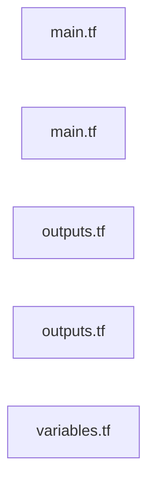

# root

> Generated by greplost. Do not edit by hand; run `greplost update`.

Path: `.` · 5 files · 59 LOC · depends on: none · depended on by: none

## Modules

```text
├── modules
│   └── logs
│       ├── main.tf
│       └── outputs.tf
├── main.tf
├── outputs.tf
└── variables.tf
```

## Module table

| File | LOC | Exports | Fan-in | Fan-out | Blast |
|---|---|---|---|---|---|
| [`main.tf`](modules/main.tf.md) | 34 | 0 | 0 | 1 | 0 |
| [`modules/logs/main.tf`](modules/modules/logs/main.tf.md) | 7 | 1 | 1 | 0 | 1 |
| [`modules/logs/outputs.tf`](modules/modules/logs/outputs.tf.md) | 3 | 1 | 1 | 0 | 1 |
| [`outputs.tf`](modules/outputs.tf.md) | 7 | 2 | 0 | 0 | 0 |
| [`variables.tf`](modules/variables.tf.md) | 8 | 2 | 0 | 0 | 0 |

## Nodes

| File | Nodes |
|---|---|
| [`main.tf`](modules/main.tf.md) | 6 |
| [`modules/logs/main.tf`](modules/modules/logs/main.tf.md) | 2 |
| [`modules/logs/outputs.tf`](modules/modules/logs/outputs.tf.md) | 1 |
| [`outputs.tf`](modules/outputs.tf.md) | 2 |
| [`variables.tf`](modules/variables.tf.md) | 2 |

## Components



## External dependencies

None.
