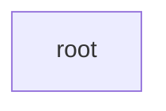

# root: package map

> Generated by greplost. Do not edit by hand; run `greplost update`.

## Package tree

```text
└── .  root
```

## Package dependencies



## Packages

| Package | Path | Files | LOC | Depends on | Map |
|---|---|---|---|---|---|
| root | . | 5 | 59 | none | [MAP](../packages/root/MAP.md) |
