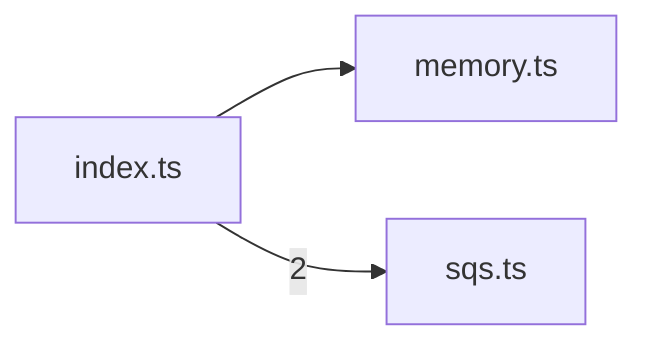

# @tiny/adapters

> Generated by greplost. Do not edit by hand; run `greplost update`.

Path: `packages/adapters` · 3 files · 51 LOC · depends on: @tiny/core · depended on by: worker

## Modules

```text
└── src
    ├── index.ts
    ├── memory.ts
    └── sqs.ts
```

## Module table

| File | LOC | Exports | Fan-in | Fan-out | Blast |
|---|---|---|---|---|---|
| [`src/index.ts`](modules/src/index.ts.md) | 3 | 4 | 1 | 2 | 1 |
| [`src/memory.ts`](modules/src/memory.ts.md) | 16 | 1 | 1 | 1 | 2 |
| [`src/sqs.ts`](modules/src/sqs.ts.md) | 32 | 3 | 1 | 1 | 2 |

## Components



## External dependencies

- `@aws-sdk/client-sqs`
