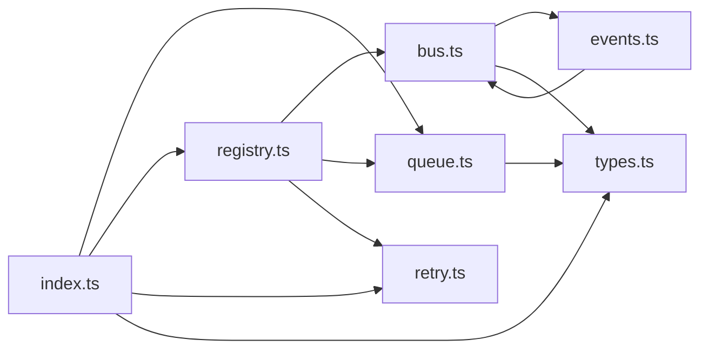

# @tiny/core

> Generated by greplost. Do not edit by hand; run `greplost update`.

Path: `packages/core` · 7 files · 99 LOC · depends on: none · depended on by: @tiny/adapters, worker

## Modules

```text
└── src
    ├── bus.ts
    ├── events.ts
    ├── index.ts
    ├── queue.ts
    ├── registry.ts
    ├── retry.ts
    └── types.ts
```

## Module table

| File | LOC | Exports | Fan-in | Fan-out | Blast |
|---|---|---|---|---|---|
| [`src/bus.ts`](modules/src/bus.ts.md) | 15 | 1 | 2 | 2 | 7 |
| [`src/events.ts`](modules/src/events.ts.md) | 9 | 2 | 1 | 1 | 7 |
| [`src/index.ts`](modules/src/index.ts.md) | 4 | 8 | 3 | 4 | 4 |
| [`src/queue.ts`](modules/src/queue.ts.md) | 14 | 3 | 2 | 1 | 6 |
| [`src/registry.ts`](modules/src/registry.ts.md) | 30 | 2 | 1 | 3 | 5 |
| [`src/retry.ts`](modules/src/retry.ts.md) | 18 | 3 | 2 | 0 | 6 |
| [`src/types.ts`](modules/src/types.ts.md) | 9 | 3 | 3 | 0 | 9 |

## Components



## External dependencies

None.
