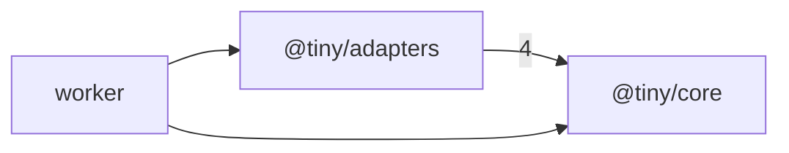

# tiny-ts: package map

> Generated by greplost. Do not edit by hand; run `greplost update`.

## Package tree

```text
├── apps
│   └── worker  worker
└── packages
    ├── adapters  @tiny/adapters
    └── core  @tiny/core
```

## Package dependencies



## Packages

| Package | Path | Files | LOC | Depends on | Map |
|---|---|---|---|---|---|
| tiny-ts | . | 0 | 0 | none | [MAP](../packages/tiny-ts/MAP.md) |
| worker | apps/worker | 2 | 25 | @tiny/adapters, @tiny/core | [MAP](../packages/worker/MAP.md) |
| @tiny/adapters | packages/adapters | 3 | 51 | @tiny/core | [MAP](../packages/tiny__adapters/MAP.md) |
| @tiny/core | packages/core | 7 | 99 | none | [MAP](../packages/tiny__core/MAP.md) |
